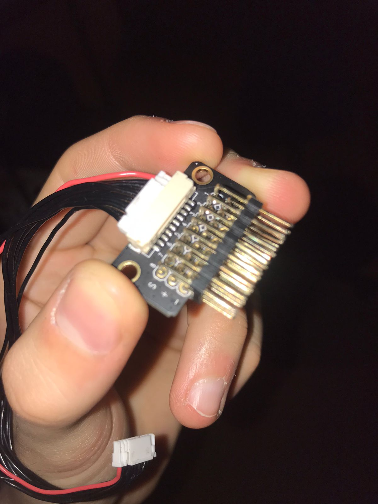

# Como controlar um servo com PixHawk 4?

> *Escrito por [Rafael Gil](https://github.com/printRafaelprog). Última atualização: 11/09/2022*

# Introdução

Nesse texto vou discutir como controlar um servo pela controladora de vôo Pixhawk 4, possíveis problemas que você pode ter fazendo isso e como concerta-los.

>Nesse texto estou utilizando o servo SG90, o qual tem esse datasheet
>http://www.ee.ic.ac.uk/pcheung/teaching/DE1_EE/stores/sg90_datasheet.pdf

## Cuidados 

O sistema que vamos discutir abaixo pode mudar dependendo da AirFrame que você selecionou para a sua aeronave na QGround. No nosso caso estamos utilizando o Generic Quadcopter. Nessa Airframe Temos acesso a 4 canais auxiliares: AUX1 até AUX4. Dependendo da airframe que você utilizar você terá acessoa outros canais auxiliares que poderi controlar. Você pode checar qual canal auxiliar você tem acesso olhando a documentação da PX4: https://docs.px4.io/main/en/airframes/airframe_reference.html

## Como fazer?

Primeiramente você deve arranjar um conector EXT-8P-V1.0  que conecte com a porta FMU PWM OUT da controladora de vôo.

 

Lembrando que semprte que vamos fazer uma conexão de módulos na controladora de vôo, precisamos lembrar que o cabo vcc geralmente é o cabo mais a esquerda. Não inverta o vcc e o ground pois isso derreterá os cabos que estão sendo utilizados (eu fiz isso por sinal ...)

Essas portas FMU PWM OUT são como portas auxiliares nas quais iremos conectar servos que fazem os periféricos do nosso drone. Existe outra porta que podmeos utilizar para controlar o PWM pela controladora, que é a IO PWM OUT. Mas essa porta é geralemnte usada para
o controle dos motores.

nesse texto estarei me referindo a **trilha** quando estiver falando da sequência de pinos que seguem na horizonal pelo conector, e **canais auxiliares** são as sequências de pinos que seguem na vertical. Nesse sentido, no conector EXT-8P-V1.0 temos 3 trilhas e 6 canais auxiliares.

Observe que nesse conetor podemos escolher de 1 a 6 portas para colocarmos o nosso servo. É importante lembrar que essas portas não recebem energia da controladora de vôo. Dessa forma, precisamos conecta-lás à alguma fonte de energia para que essa alimente o servo. Dessa forma, podemos utilizar um ubec que regular a tensão para 5V para conectarmos em um dos canais auxiliares RESPEITANDO A TRILHA QUE REPRESENTA O VCC E AQUELA QUE REPRESENTA O GND NO CONECTOR. A trilha GND é representada pelo sinal "-" e
a trilha vcc é representada pelo sinal "+". Ao conectarmos nosso Ubec nessa trilha, energizaremos toda a trilha, já que os pinos de uma trilha estão todos em curto. 

Agora podemos conectar nosso servo em um dos canais auxiliares de modo que seu vcc se encontre com o vcc no conetor e seu gnd se
encontre com o gnd do conector. 

Agora será necessária conectar alguns componentes no drone para nós podemos controlar o servo pela controladora de vôo. Esses componentes são:

- A controladora de vôo
- Receptor rádio controle 
- bateria 
- Ubec (para alimentar o servo)
- PMB (para alimentar a controladora de vôo)

Além disso será necessária uma telemetria conectada no computador do usuário para fazer comunicação com o drone.

Agora iremos fazer com que um dos canais do controle controlem o giro do servo. Para isso vamos acessar
a **QGroundControl**. Acesse QGroundControl > Vehicle Setup > Parameters

Quando acessado a página de parâmetros, Busque por **RC_MAP_AUX**. aparecerão 6 parâmetros variando de  RC_MAP_AUX1 ate RC_MAP_AUX6.
Esse parâmetro refere-se aos canais auxiliares onde seu servo pode estar conectado. Escolha um desses parâmetros para ser utilizado para controlar o PWM de seu servo. Selecione algum canal do controle por onde será enviado o sinal de controle do servo. 

>enquanto estávamos tentando fazer esse sistema funcionar tentamos usar os canais de 1 a 4 para controlar o pwm. Esses usualmente são utilizados para o controle do vôo do drone. NÃO DEU CERTO! Então, busque urilizar os outros canais que apresentam posições fixas ao invés de um grande range de movimento (canal 6, por exemplo). 

Agora garanta que seu drone está armado antes de testar o servo. Pela nossa experiência tentando fazer esse sistema funcionar, **o servo só resposndia à comandos do controle quando o drone estav armado**.

Agora temos duas possibilidades. Ou seu servo já está funcionando, ou você é um membro do hardware raiz cujos trabalhos nunca funcionam de primeira. Pelo último indivíduo, vamos trabalhar um pouco em corrigir possíveis erros. 

# Debugando

## 1 - Troque seu canal auxiliar

Provavalemente seu canal auxiliar que não está funcionando pode não estar recebendo PWM. Dessa forma troque seu servo de canal auxiliar e teste-o de novo. Não se limite a conectar seu servo apenas no canal auxiliar que você designou no parâmetro RC_MAP_AUX da QGround. No nosso caso, nosso servo só funcinou quando o conectamos no canal auxiliar 6 e colocamos para mandarmos PWM no RC_MAP_AUX2. Uma boa tática seria definir todos os RC_MAP_AUX em um canal do controle só e ir mudando seu servo de posição até encontrar a saída de pwm certa. Depois você pode ir colocando esses parâmetros um por um em "Unsigned" até encotrar o parâmetro que realmente está controlando seu servo. Se você teve problema com o canal auxiliar que conectou seu servo, provavelmente é porque seu conector ou se cabo estão quebrados. 

## 2 - Mude alguns parâmetros

Para o controle de PWM com a porta FMU PWM OUT temos mais alguns parâmetros que podem interferir no bom funcionamento do servo. Um exemplo de parâmetro que pode ser útil checar é o **PWM_AUX_RATE**. Esse controla a frequência de PWM que sai dos canais FMU PWM OUT.
Outros 2 Parâmetros que podem ser importantes é o **PWM_AUX_MAX** ou **PWM_AUX_MIN**. Esses parâmetros controlam o valor máximo e mínimo que o PWM pode atingir. Isso controlaria até onde seu servo se mexeria quando recebe um sinal de PWM. No entanto (pelo menos no nosso caso, não foi necessário mudar esses parâmetros para o correto funcionamento do servo)

>quando o servo estiver conectado no seu drone, ele pode sofrer alguns espasmos provavelmente gerados por ruídos do sistema que chegam até ele. Pela nossa experiência, eses espasmos não foram suficientes para movimentar o servo, já que não representam sinais PWM. Portanto não parece um possível problema, mas também não fizemos uma investigação a fundo

# Referências

Para fazer esse sistema nos baseamos no seguinte vídeo: https://www.youtube.com/watch?v=A7JpgpJadKM do canal Alex Fache. 
