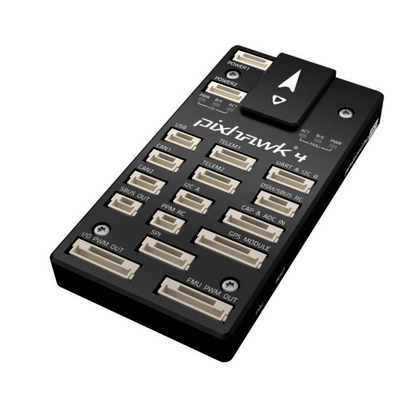

# Como controlar um servo a partir da controladora de vôo PixHawk 4

## Observações: 
Nesse texto estou utilizando o servo SG90, o qual tem esse datasheet ->
 http://www.ee.ic.ac.uk/pcheung/teaching/DE1_EE/stores/sg90_datasheet.pdf

## Como fazer?

Primeiramente você deve arranjar um conector (verificar nome do conector utilizado) que conecte com a porta FMU PWM OUT da controla
dora de vôo.

 

Lembrando que semprte que vamos fazer uma conexão de módulos na controladora de vôo, precisamos lembrar que o cabo vcc geralmente 
é o cabo mais a esquerda. Não inverta o vcc e o ground pois isso derreterá os cabos que estão sendo utilizados (eu fiz isso por sinal ...)

Essas portas FMU PWM OUT são como portas auxiliares nas quais iremos conectar servos que fazem os periféricos do nosso drone. Existe outra
porta que podmeos utilizar para controlar o PWM pela controladoram, que é a IO PWM OUT. Mas essa porta é geralemnte usada para
o controle dos motores.

(Foto do conector)

nesse texto estarei me referindo a trilha quando estiver falando da sequência de pinos que seguem na horizonal pelo conector, e canais 
auxiliares são são as sequência de pinos que seguem na vertical. Nesse sentido, nesse conector (nome) temos 3 trilhas e 6 canais 
auxiliares.

Observe que nesse conetor podemos escolher de 1 a 6 portas para colocarmos o nosso servo. É importante lembrar que essas portas não 
recebem energia da controladora de vôo. Dessa forma, precisamos conectar à alguma fonte de energia esse conector para que alimente
o servo. Dessa forma, podemos utilizar um ubec que regula tensão para 5V para conectarmos em um dos canais auxiliares RESPEITANDO
A TRILHA QUE REPRESENTA O VCC E AQUELE QUE REPRESENTA O GND NO CONECTOR. A trilha GND é representada pelo sinal "-" e a trilha
vcc é representada pelo sinal "+". Ao conectarmos nosso Ubec nessa trilha, energizaremos toda a trilha, já que os pinos de uma trilha
estão todos e curto. 

Agora podemos conectar nosso servo em um dos canais auxiliares de modo que seu vcc se encontre com o vcc no conetor e seu gnd se 
encontre com o gnd fo conector.  

