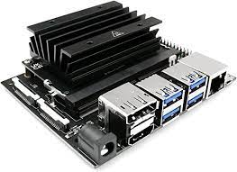
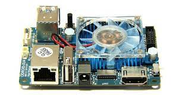
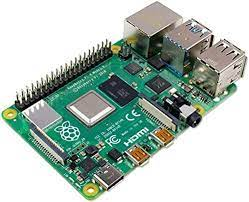

# Computadores de Bordo (Odroid XU4 vs Raspberry 4)
> *Escrito por [Artur Paparounis](https://github.com/artur-papas). Última atualização: 22/11/2022*

O computador de bordo, ou Single Board Computer (SBC), é utilizado nos drones para realizar algumas funções computacionais que não podem ser feitas dentro da controladora de voo e que seriam menos eficientes e independentes se realizadas offboard. 

## Funções principais do computador de bordo

As principais atividades realizadas no computador de bordo de drones são: 
- Controle geral do drone, utilizando ROS e se comunicando com o drone por MavLink
- Processamento de dados de sensores, como temperatura, nível de CO2, distância de obstáculos, etc
- Incorporação de dados de odometria visual (como os provenientes da Realsense T265) no posicionamento do drone
- Realização de computação visual para identificar objetos, cores ou marcadores (como ArUcos e QRcodes)
- Utilização de inteligências artificiais para identificação de objetos, objetivos ou obstáculos

## Considerações ao se escolher um computador de bordo

Ao se escolher um computador de bordo para um drone deve se levar em conta algumas restrições impostas pelo desafio, pelo drone e pelos processos sendo realizados pelo computador de bordo. Os principais são:
- Espaço e massa disponíveis para o computador de bordo
- Verba disponível para adquirir um computador de bordo mais potente
- Quantidade de memória RAM no SBC
- Capacidade de processamento do SBC
-  Disponibilidade de intefaçes com outros dispositivos (número e tipo dos USBs, porta HDMI, módulo WI-Fi nativo, módulo Bluetooth nativo, cabo ethernet, entre outros)
- Suporte da empresa que desenvolveu o SBC
- Documentação disponível sobre o SBC
- Disponibilidade de programas, bibliotecas e firmwares já portados para o SBC e disponíveis na internet

## Alguns modelos de computador de bordo

Dentro da SkyRats ja foram utilizados 4 computadores de bordo extensivamente e para uso em competições ou testes reais.

O computador de bordo mais potente usado pela equipe foi a **Jetson Nano**, que possuia 4Gb de memória RAM, uma placa de vídeo integrada, uma CPU quad core de 1,4 GHz. Esse SBC é ideal para o uso de IA, visto que consegue executar reconhecimento relativamente complexo de imagem sem ocupar muito espaço e peso. Contudo, para as outras utilizações de computadores de bordo o Jetson Nano é demasiado potente, não sendo utilizado totalmente. Nesse caso seus contras são um detrimento para o drone, como seu preço de cerca de 3000 a 4000 reais e seu peso de 240g.

Outro computador de bordo ja utilizado para testes em drones foi a **Labrador 64bits**, que é desenvolvida pela Caninos Loucos e de facil acesso para a equipe. Contudo, por ser um SBC recente e relativamente desconhecido ainda não apresenta muito engajamento da comunidade e quase nenhum software portado. Dessa forma, muitos problemas básicos e desconhecidos foram encontrados durante alguns testes em 2022, mas um voo autônomo foi realizado como prova de conceito.

Durante um longo período de tempo foi utilizado o **Odroid XU4** como computador de bordo, devido a seu preço relativamente baixo de 700 reais e seu peso reduzido de apenas cerca de 50g. Ademais, para seu preço a Odroid possui um processador potente, sendo um Exynos-5422, que é um octa-core com 4 cores de 2,1GHz e 4 cores de 1,4GHz. Um dos principais problemas com a Odroid é sua memória RAM de apenas 2Gb, que é pequena, especialmente se comparada com o processador do próprio SBC.

Em 2022 foi feita a transição da Ordoid XU4 para a **Raspberry Pi 4** na SkyRats, antecedendo a IMAV 2022. O Raspberry Pi é computador de bordo é o mais utilizado por outras equipes de competição de drones e desenvolvedores independentes. Além disso, há uma comunidade enorme de embarcados em volta desse produto, possibilitando encontrar muita documentação, bibliotecas e firmwares na internet. Ademais, a RPi4 é potente, possuindo versões com 4Gb de RAM e um processador quad-core de 1,5GHz. Seu preço é um pouco superior a Odroid, sendo encontrada por 1200 reais.

## Odroid XU4 vs Raspberry Pi 4

Durante os testes que antecederam a IMAV 2022 foi feita a escolha de deixar a ODROID XU4 de lado como compputador de bordo utilizado pela equipe, principalmente pelo fato do SBC apresentar algumas inconstâncias de funcionamento; pouca documentação, firmwares e biblioteecas disponíveis na internet, além de pouca memória RAM. Após a compra e uso da Raspberry Pi 4 pode ser feita uma análise da mudança:

### Prós:
- Mais memória RAM (4GB vs 2GB)
- Mais documentação na internet, facilitando achar projetos já prontos e resolução de problemas que pudessem ocorrer
- Mais consistência no funcionamento do SBC
- GPIOs de tamanho e espaçamento padrão na RPi, permitindo facilmente conectar jumpers (GPIOs da ODROID são muito esppecíficos e geram problemas)
- Conectividade WI-Fi e Bluetooth nativa, não necessitando de módulo Wi-Fi externo
### Contras:
- Preço mais elevado (1200 vs 700 reais)
- Menor capacidade de processamento (processador com menos núcleos e mais lento)

Com o funcionamento perfeito durante a IMAV 2022, o Raspberry Pi 4 foi utilizado permanentemente na equipe após a competição.
