# Planejamento dos drones - Imav 2022 Outdoor

> *Escrito por [Artur Paparounis](https://github.com/artur-papas). Última atualização: 19/04/2023*

A competição outdoor da IMAV 2022 possuia 6 desafios a serem compridos em 30 minutos. Dessa forma, tivemos que escolher a melhor forma de balancear a complexidade e tempo de desenvolvimento dos drones, a otimização dos drones para as provas específicas, e a complexidade da operação durante os 30 minutos de prova. A otimização proposta aqui é uma mistura entre a análise feita durante a preparação e após a realização da competição, visto que as estratégias foram mudando muito conforme os desafios foram sendo mais compreendidos pela equipe e conforme fomos conseguindo ou não ter sucesso em fazer os drones funcionar.
## Otimização necessária para cada prova
Já que todas as provas necessitavam da entrega de pacotes, a otimização básica que todos os drones necessitavam era a capacidade de carregar e soltar pacotes de 1 kg. Em alguns casos levar 1kg não era a melhor escolha, pois afetaria de forma negativa a autonomia e velocidade do drone, mas a princípio esses requisitos levariam a um melhor desempenho na competição.
Outro fator considerado foi a massa dos drones, que deveria ser minimizada, visto que a pontuação das missões era dividida pela massa do drone que a realizou.
### 1) Delivery at known location
- Bom posicionamento de GPS para auxiliar centralização e chegar ao local base correto
- Uso básico de câmera para detecção e centralização no ArUco
### 2) Delivery at uncertain location
- Bom posicionamento de GPS para auxiliar centralização e identificar a região correta onde poderia estar o ArUco
- Necessidade de câmera de boa qualidade para detectar o ArUco em movimento e a distância durante uma varredura da área
- Necessidade de boa autonomia para permitir percorrer a área de incerteza durante a detecção do ArUco
### 3) Delivery at uknown location
- Bom posicionamento de GPS apenas necessário para auxiliar a centralização
- Necessidade de câmera muito boa, que permita detectar os ArUcos a uma distância grande e identificar o correto
- Necessidade de ótima autonomia para percorrer grande área onde ArUco correto pode estar
### 4) Silent Delivery
- Bom posicionamento de GPS para determinar local onde deixar o pacote
- Sem necessidade definitiva de câmera caso precisão do GPS seja melor do que 2 metros
- Baixa geração de som
### 5) Delivery at moving pickup truck
- Bom posicionamento de GPS para auxiliar centralização
- Câmera boa e rápida para permitir centralizar em um objeto em movimento
### 6) Delivery far and fast
- Bom posicionamento de GPS para auxiliar centralização, chegar ao local base correto e detectar limites do circuito
- Uso básico de câmera para detecção e centralização no ArUco
- Necessidade de ótima autonomia para permitir percorrer a maior distância possível de forma rápida nos 30 minutos da competição
## Escolha dos drones a serem usados
Para ecolher quantos e quais drones faríamos deveria ser considerado quais missões demorariam mais, quais missões poderiam ser realizadas pelos mesmos drones sem muita perda de otimização, quais missões possibilitam ganhar mais pontos e quais missões são mais difíceis.
### *Critério de tempo*
- **Demoradas** - 3 e 6
- **Médias** - 2 e 5
- **Rápidas** - 1 e 4
### *Critério de features do drone*
- **Autonomia** - 2, 3 e 6
- **Câmera** - 1, 2, 3, 5 e 6
- **SIlencioso** - 4
### *Critério de pontuação*
- **Alta** - 3, 5 e 6
- **Média** - 2 e 4
- **Baixa** - 1

### *Critério de dificuldade*

 - **Difícil** - 3 e 5
- **Média** - 2 e 6
- **Fácil** - 1 e 4
### *Decisão final*
- **Drone genérico** - Missões 2 e 5
Esse drone não necessitaria de muita autonomia, mas precisaria de uma câmera de boa qualidade e deveria ser agil para pousar na picape em movimento. O drone tentaria a missão 5 até ter sucesso ou percebemos que não seria possível, depois voltaria para trocar a bateria e ir para a missão 2.
- **Drone de autonomia** - Missões 1 e 6
Um drone com maior capacidade de autonomia e com uma necessidade menor de qualidade de câmera. O drone faria a missão 1 primeiro, garantindo a pontuação, e depois voltaria para pegar mais um pacote e fazer uma troca de baterias para a missão 6.
- **Drone silencioso** - Missões 3 e 4
Esse drone seria focado em minimizar o barulho gerado pelas hélices e motores do drone para a missão 4. Além disso, a otimização para a eficiência sonora acaba permitindo uma autonomia grande também, visto que um drone que gera menos energia sonora tende a gastar menos energia e gerar empuxo de uma forma mais eficiente também, sendo mais econômico. O drone faria a missão 4 primeiro, garantindo a pontuação, e depois voltaria para fazer uma troca de baterias para a parte de reconhecimento da missão 3, para por fim voltar e pegar o pacote para a entrega.

## Drone genérico
O drone genérico foi projetado para ser a base para os testes e o desenvolvimento dos outros drones. Ele foi projetado para ser capaz de realizar todas as missões básicas que não necessitavam de características especiais, como a 1, 2, 4 e 5. Além disso, foi o primeiro a ser projetado pela mecânica, montado e testado pelo hardware, permitindo achar a maioria dos problemas a serem resolvidos.
### Propulsão
- **Motores** (T-Motor F80 Pro - 1900KV) - Os motores F80 Pro foram escolhidos pela equipe já possuir muitos dele em estoque, já que foram adquiridos para o projeto do swarm. Ademais, esses motores eram os únicos que possuíamos capazes de gerar o empuxo necessário para carregar a caixa de 1kg, apesar de serem muito ineficientes e permitirem apenas 5 minutos de autonomia no resultado final.
- 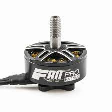
- **Hélices** (GemFan 5055) - As hélices mais utilizadas para os testes e no projeto final eram as hélices 5055 da GemFan, já que tinhamos elas em abundância e o uso delas com os motores F80 Pro permitiam carregar 1kg de caixa. Após um pouco mais de estudo percebemos que hélices de 6 polegadas como as 6040 seriam mais eficientes, mas não conseguimos comprá-las a tempo da competição.
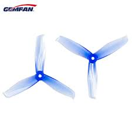
- **Baterias** (LiPo 4000mAh ou 6000mAh) - As baterias que a equipe possuia e permitiam a melhor autonomia e o menor peso aos drones eram as  de 4000 e 6000mAh. Assim, escolhemos o uso de bateria para permitir usar todas as baterias que possuíamos de forma distribuida nas missões. A ideia era utilizar a bateria de 6000 na missão 2 e a bateria de 4000 na missõa 5.
- **ESCs** (Mamba 4-in-1 50A) - A baixa eficiência dos motores fez com que fosse consumida muita corrente, necessitando de um ESC que aguentasse essa demanda. No caso da equipe, usamos os ESCs 4-em-1 da Mamba, que também já possuíamos e eram leves, pequenos e aguentavam a corrente necessária, apesar de que geraram alguns problemas, pois era mais fácil dos fios dessoldarem ou de uma pequena falha gerar problemas para todos os motores.
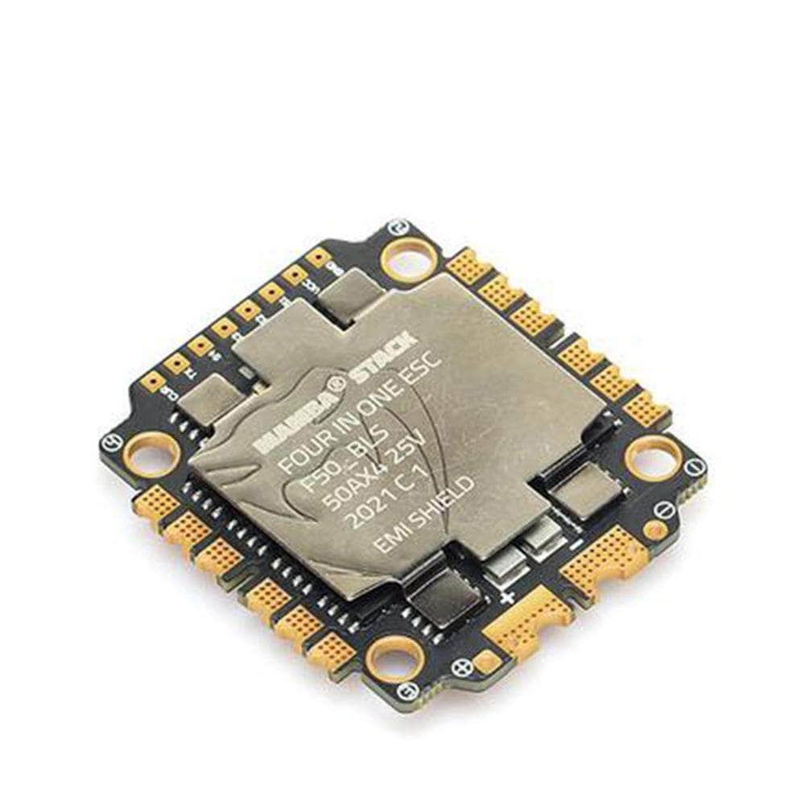
## Drone de autonomia
O drone de autonomia foi desenvolvido para ter o máximo de autonomia possível carregando a caixa de 1kg. Assim, ele conseguiria dar o máximo número de voltas na missão 6, ganhando mais pontos. A ideia inicial era realizar a montagem desse drone utilizando o frame Tarot, com os motores T-Motor MN3110 - 470kv e hélices de 17 polegadas feitas de fibra de carbono, porém não conseguimos fazer o Tarot voar de forma estável e em um de nossos testes a hélice quebrou, sendo inviável comprar outra até a competição. No final, o frame utilizado foi o F450, que é leve e grande quando comparado a outros drones da equipe, permitindo o uso de hélices maiores e mais eficientes.
### Propulsão
- **Motores** (RCTimer MT2610 - 920KV) - Esses motores foram doados para a equipe por um ex-membro e serviram muito para nossas necessidades. Por ter um kv mais baixo, o motor é mais adequado para hélices maiores, que são mais eficientes. Ademais, pudemos utilizar as hélices da dji que são inclusas no F450 e nos drones da linha Phantom, o que nos ajudou muito por já possuirmos essas hélices em excesso. Ademais, esses motores tinham um limite de potência muito superior aos padrão da DJI, podendo gerar o empuxo necessário para carregar a caixa de 1kg.
- 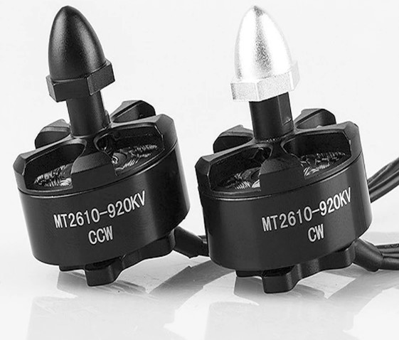
- **Hélices** (DJI 9450) - Uma das hélices mais comuns da DJI, sendo inclusa nos drones Phantom e F450, tem uma grande capacidade de gerar empuxo e é relativamente eficiente, devido ao seu tamanho.
- 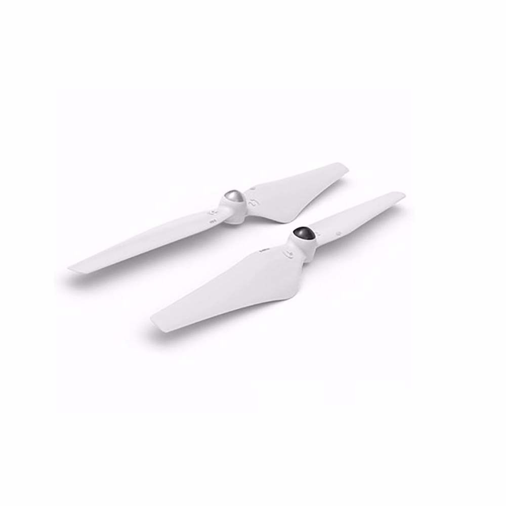
- **Baterias** (LiPI 4000mAh ou 8000mAh) - Para esse drone, foi escolhida a bateria de 4000mAh para a missão 1, para tornar o drone mais leve. Já para a missão 6 foi escolhida a bateria de 8000mAh, para permitir o maior tempo possível de drone e obter a pontuação máxima na missão.
- **ESCs** (Simples de 40A) - ESCs genéricos individuais de 40A foram escolhidos, visto que eram bem baratos e substituíveis caso algum problema surgisse.
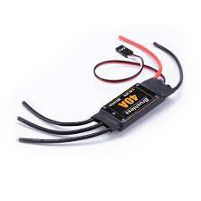
## Drone silencioso
O drone silencioso foi feito e otimizado para gerar o mínimo possível de intensidade sonora durante sua operação. Essa pesquisa foi feita para tentar ganhar mais pontos na missão 4 da competição, mas também foi muito produtiva para a equipe, visto que esse é um tema de extrema relevância no cenário de soluções reais com drones.
O que se descobriu foi que o barulho dos drones vêm principalmente da rotação das hélices e ddo motor, além de várias instabilidades. Assim, além do dimensionamento correto, o drone deveria ser melhor balanceado e calibrado do que todos os outros, para oferecer o mínimo de instabilidades que gerariam barulhos. Outro ponto importante é a massa do drone, visto que drones mais leves necessitam de menos propulsão para voarem, gerando menos intensidade de som. Assim, utilizamos as menores telemetrias e receptores RC para esse drone, afim de minimizar seu peso.
Os componentes mencionados a seguir acabaram não sendo integrados e montados em um drone durante a competição, devido a atrasos e imprevistos, mas os componentes foram comprados e muito pesquisados.
### Propulsão
- **Motores** (T-Motor MN3508 - 700KV ) - Os motores MN3508 da T-Motor são extremamente potentes e apresentam muito torque e um baixo KV. Isso os torna bons para o uso de hélices grandes, com um diâmetro e corda maiores do que nossos outros drones. Ademais, um KV baixo facilita o uso da tecnologia de FOC, visto que é mais fácil de estimar a posição do motor e controlá-lo com uma frequência menor de samples.
- 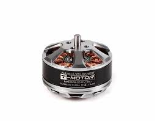
- **Hélices** (Hélice 1238) - O melhor tipo de hélice para minimizar o barulho gerado pelo drone apresenta maior área de superfície, menor pitch e menor velocidade de rotação. Assim, hélices de 12 polegadas de diâmetro e 3,8 polegadas de pitch foram escolhidas. Hélices de 3 pás também poderiam ser interessantes, visto que tem ainda mais área de superfície.
- 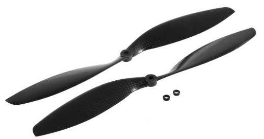
- **Baterias** (LiPo 4000 e 8000mAh) - Para a missão 3, baterias de 8000mAh eram mais interessantes, afim de garantir o máximo de autonomia possível para percorrer a área e achar o ArUco correto. Já para a missão 4, uma massa menor era mais interessante, então a bateria de 4000mAh foi a melhor escolha.
- **ESCs** (T-Motor Alpha 40A) - Os ESCs da linha Alpha da T-Motor apresentam uma feature muito desejada para drones silenciosos, chamada de Field Oriented Controlling (FOC). Essa tecnologia permite controlar os motores com ondas senoidais, baseando o controle do motor em sua posição durante toda a rotação, e não apenas no ponto no qual os imãs cruzam as bobinas. Ao substituir as ondas quadradas comuns com ondas senoidais, o barulho gerado pela rotação dos motores é quase que eliminado, deixando apenas o som das hélices. Essa melhoria poderia aumentar a eficiência e estabilidade dos drones, além de diminuir a intensidade sonora em de 2dB a 5dB.
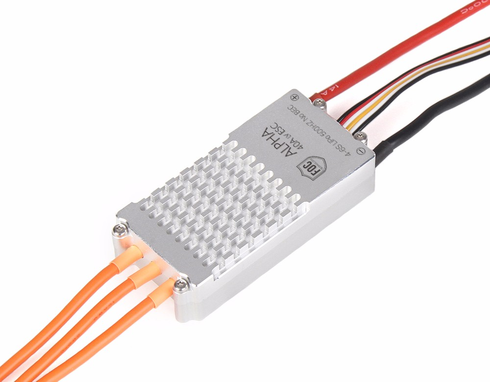
# Componentes comuns ou não fixos
Alguns componentes, em específico controladoras de voo, computadores de bordo, GPS, telemetria e câmera foram comuns a todos os drones ou podiam ser trocados entre eles, visto que não havia muito maior otimização a ser feita ou por falta de tempo para testar e ver as reais necessidades de cada missão.
* **Controladora de voo** (Pixhawk 4 ou PixRacer) -  Como durante a IMAV 2022 nossos drones eram controlados por ROS e todo o processamento ocorria no computador de bordo, não era necessário de um processador muito poderoso. Assim, o F4 da PixRacer e o F7 da Pixhawk 4 eram mais do que suficientes para nossas missões. As duas foram escolhidas por terem os conectores JST-GH já compatíveis entre si e com nossos outros componentes. Por fim, essas controladoras eram mais consistentes e robustas do que as Pixhawk 1 que tinhamos, apesar de que a PixRacer ainda dava alguns problemas e dalays de vez em quando.

* **Computador de bordo** (Raspberry Pi 4) - Após a mudança da Odroid XU4 para a Raspberry Pi 4, já descrita em nossa documentação, utilizamos a RPi 4 para os 3 drones, devido ao seu processamento, conectores e memória RAM adequados ao nosso uso.
* 
* **GPS** (Ublox Neo-M8N) - O GPS UBlox M8N é extremamente potente e confiável, quase nunca gerandoproblemas e sempre conseguindo boa conexão com satélites mesmo perto de prédios ou estruturas metálicas.
* 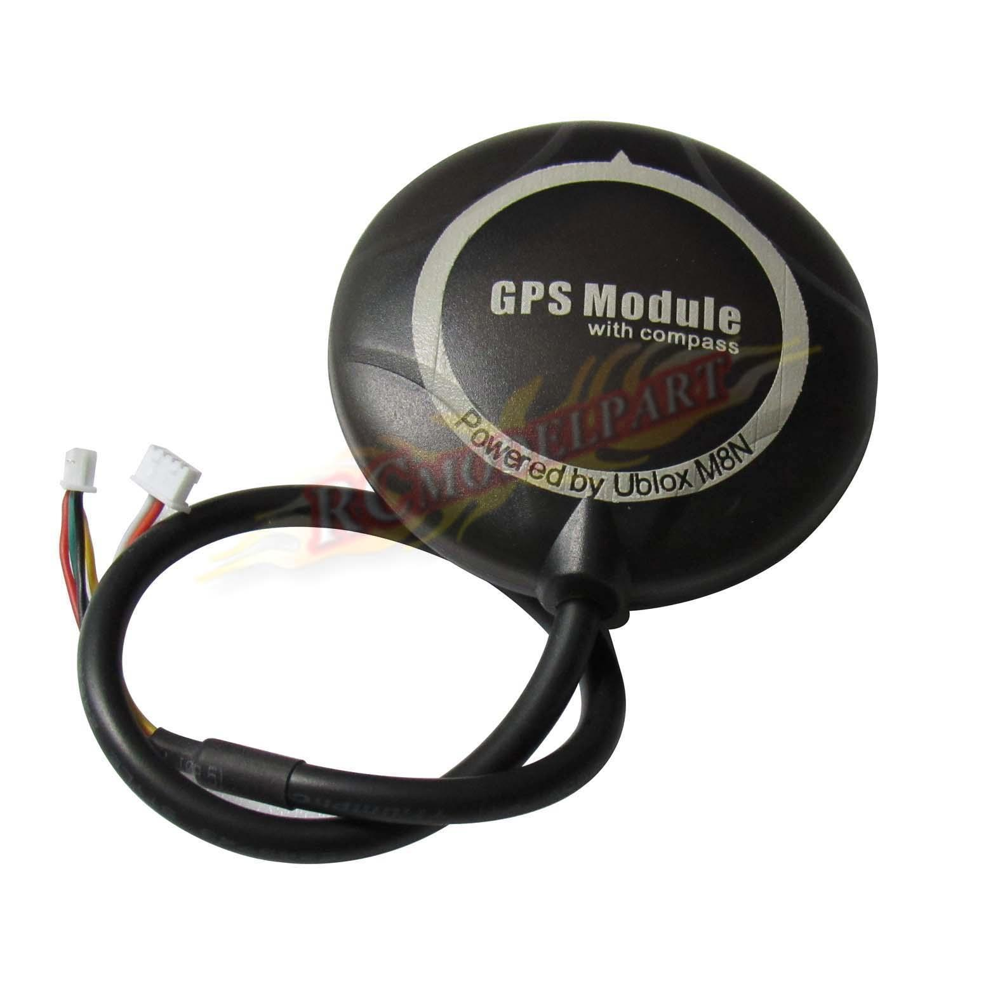
* **Telemetria** (Holybro V3) - A telemetria V3 da Holybro sempre foi o padrão da equipe, sendo extremamente consistente, confiável e leve. Seu maior problema é seu alcance, que só é garantido até 300m, obtendo até menos em condições não ideias. Mas como nosso processamento era completamente embarcado no drone, a conexão de telemetria só precisava acontecer próxima à base para permitir a nós dar comandos e iniciar as missões.
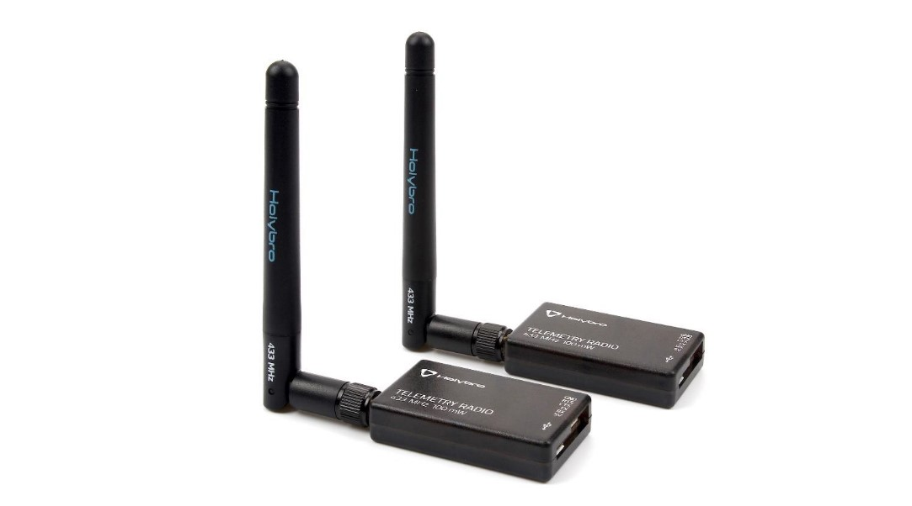
* **Câmera** (Elecbee OV 2710) - Essa câmera foi a utilizada para todas as missões, visto que não tivemos muito tempo para testar diferentes marcas, modelos e especificações. Suas especificações incluiam resolução Full-HD, FOV de 145º e sua conexão era feita por USB. Na realidade, a resolução real era muito menor do que a especificada e o FOV grand era devido a uma lente fish-eye que distorcia demais as imagens. A conexão por USB era realmente muito interessante por sua versatilidade.

