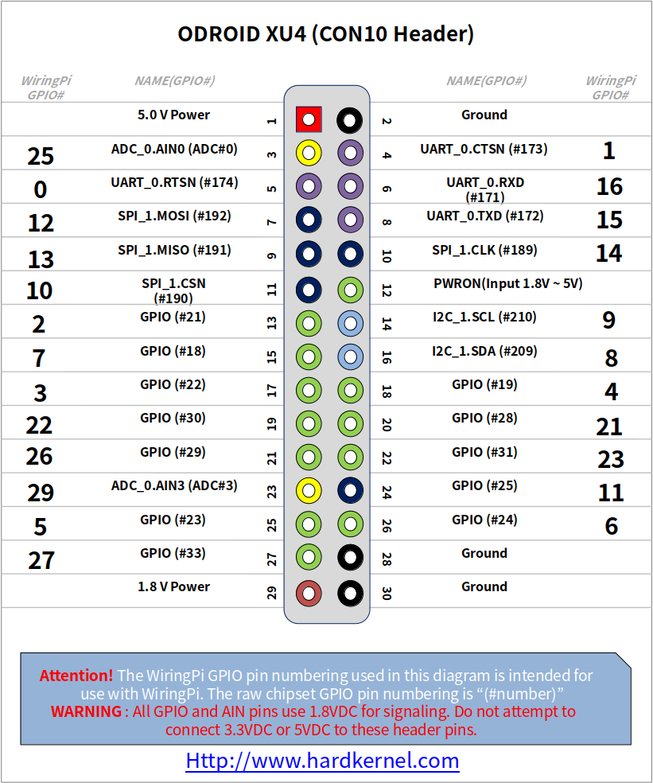

# CCS811

> *Escrito por [Felipe Namour](https://github.com/FeCLN). Última atualização: 15/08/2022*

É um sensor para detectar niveís de CO2, ele é I2C, e aqui vamos conectar e usar ele em uma Odroid XU4 apenas para pegar o valor de ppm de CO2 do ambiente


## Conexão

Para fazer a conexão do sensor, fazemos da seguinte forma:

> Pino VCC no pino 29 (1.8V)

> Pino GND no pino 28 (GND)

> Pino SCL no pino 14 (I2C_1.SCL)

> Pino SDA no pino 16 (I2C_1.SDA)

> Pino WAK no pino 2 (GND)

O pinout da Odroid XU4:



## Código

O código é dividido em dois scripts, o primeiro, start.sh tem a função de iniciar o sensor, ou seja, tirar ele do bootmode e colocar no modo de medição a cada 1s.

Para isso precisamos primeiro ler o registrador de status(0x00), e fazemos isso assim:

 > i2cget -y 0 0x5a 0x00;

Caso inicie sem erro, ele retornará 0x10

 Agora para tirar o sensor do boot mode, mandamos um valor vazio para ser escrito no registrador de start(0xF4):

 > i2cset -y -a 0 0x5a 0xF4 c;

 Após isso precisamos setar o modo de funcionamento no registrador measurement mode(0x01):

 > i2cset -y -a 0 0x5a 0x01 0x10;

 Assim, teremos nosso sensor realizando as medidas e colocando as em valor de ppm ja calculada no registrador 0x03

 Para retornarmos esses valores medidos utilizamos um script em python para ser integrável mais facilmente com outros códigos, mas de mesma forma, utilizamos comandos da biblioteca i2c-tools, oque para utilizarmos em python fazemos uso da biblioteca subprocess

Exemplo:

```python
import subprocess
rawData = subprocess.Popen("i2cget -y 0 0x5a 0x03 w;", shell=True, stdout=subprocess.PIPE).stdout).read().decode()
```

Para retirarmos os valores de PPM de CO2 do sensor, acessamos o registrador 0x03, porém lemos 2 bytes ao invéz de 4 utilizando o "mode word(w)":

> i2cget -y 0 0x5a 0x03 w;

tendo isso, precisamos ordenar os bits da seguinte forma:

b4b3b2b1 &rarr; b3b4b1b2

Assim, é so realizar a transformação de hexadecimal para decimal e teremos o valor de PPM de CO2

## Referências

- [Datasheet do sensor](https://cdn.sparkfun.com/assets/learn_tutorials/1/4/3/CCS811_Datasheet-DS000459.pdf)

- [Biblioteca i2c tools - documentação](https://www.mankier.com/package/i2c-tools)
