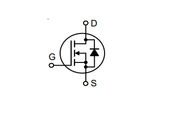
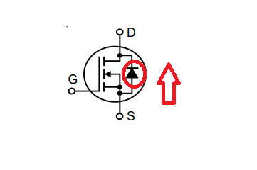
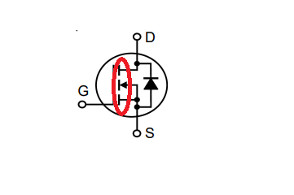
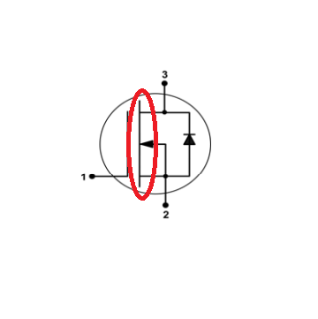
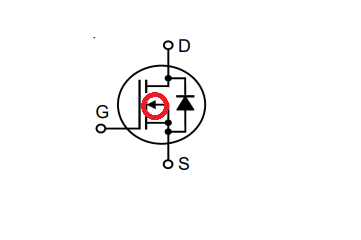
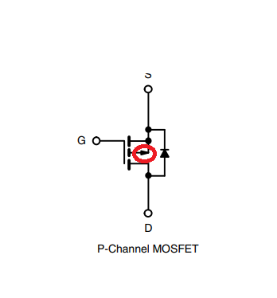
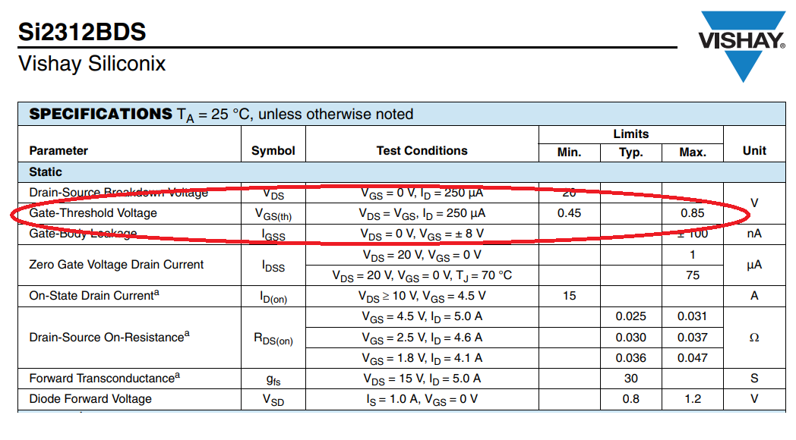
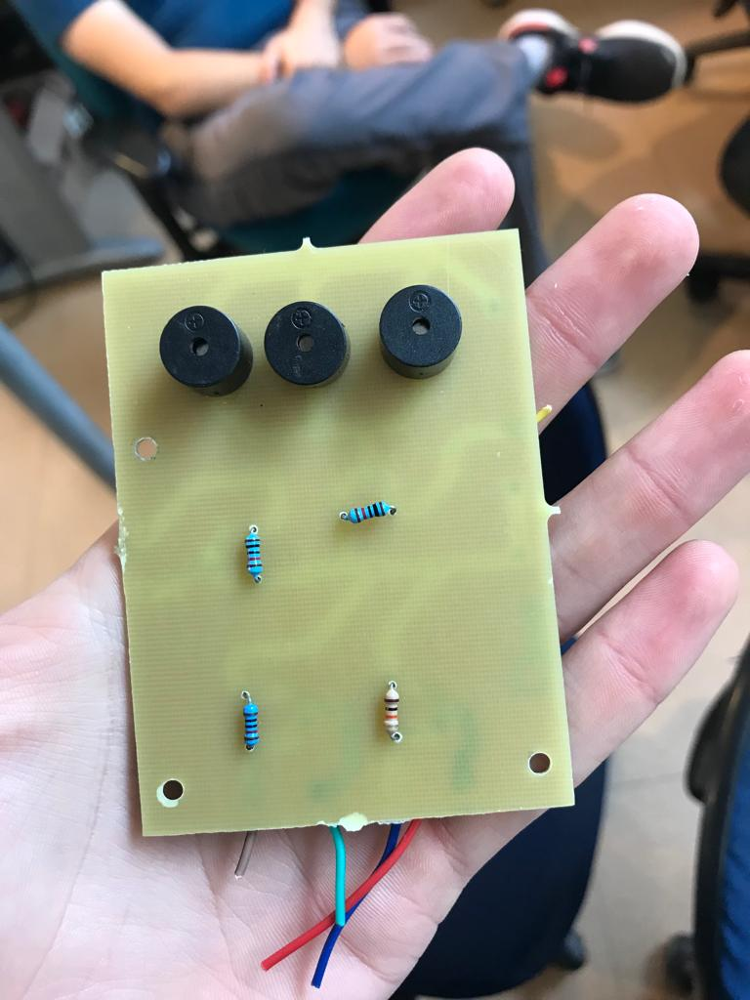
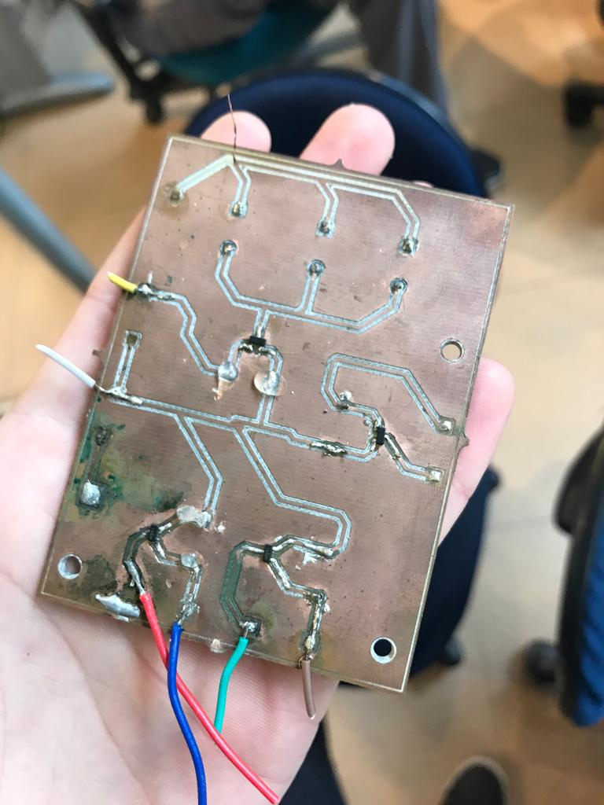

# Como Fazer um switch com Mosfet?

> *Escrito por [Rafael Gil](https://github.com/printRafaelprog). Última atualização: 26/12/2022*

## Introdução

Eu escrevi uma documentação sobre [como fazer um switch com transitor](https://skyrats.github.io/knowledge_base/docs/Componentes%20Eletr%C3%B4nicos/Transistor) a um tempo. No entanto apontei para o fato de transistor BJT consumir muita corrente para fazer um chaveamento. Por isso, o ideal é utilizarmos um mosfet para fazermos chaves. Isso pq o mosfet quase não consome corrente no processo de abrir e fechar o circuito, já que ele, diferente do bjt, depende mais da tensão entre gate e source do que da corrente que passa no gate. 

## Resumo Mosfet

Um mosfet em um circuito parece com isso: 

Fonte: https://br.mouser.com/datasheet/2/240/Littelfuse-2900658.pdf

Esse tipo de imagem está presente em quase todos os datasheets de mosfets. Apartir dela conseguimos tirar detalhes importantes do nosso componente como:

- 1- Saber se ele é um mosfet de enriquecimento ou de deplexão.
- 2- Saber se ele é de canal n ou canal p.
- 3- Saber se ele apresenta algum diodo interno.

Um mosfet é composto por 3 canais, eles são o **gate**, o **source** e o **drain**. A corrente passa pelo canal do mosfet no sentido drain e source, e passa pelo diodo no sentido source drain. O diodo é representado no mosfet pela bolinha vermelha, e o sentido que a corrente passa está indicado pela seta vermelha. 

Fonte: https://br.mouser.com/datasheet/2/240/Littelfuse-2900658.pdf

>Observação: se você não sabe o que é um diodo, deixo [aqui](https://www.youtube.com/watch?v=Fwj_d3uO5g8&t=486s) um link de um vídeo para você entende melhor. Se preferir um vídeo em português, deixo ele [aqui](https://www.youtube.com/watch?v=rR8WdjZ5tHQ). 

Vamos começar explicando o tópico **1-**. Um mosfet de enriquecimento é aquele que apresenta canal aberto naturalmente, ou seja, não existe conexão entre drain e o source. 

Isso pode ser visto apartir das barrinhas desticadas abaixo.

Fonte: https://br.mouser.com/datasheet/2/240/Littelfuse-2900658.pdf

Quandos elas são separadas, o mosfet é de enriquecimento. 

Quando as barrinhas são juntas,  mosfet é de deplexão.

Fonte: https://br.mouser.com/datasheet/2/196/Infineon-BSS159N-DS-v02_02-en-520782.pdf

Quando o mosfet é de deplexão, o canal entre o drain e o source já é estabelecido. 

>Nesse caso, no entanto, existe a conexão através do diodo. Mas observe que ele só permitirá que a corrente passe em um sentido.

Para que uma conexão se forme no mosfet para que ele permita a passagem de corrente **pelos dois sentidos** é necessário aplicar uma tensão entre gate e source. 

Isso me dá o gancho para falar sobre o tópico **2-**. Um mosfet **canal n** exige que exista uma tensão positiva entre gate e source. Isso significa que (Vg - Vs) > 0, sendo Vg a tensão aplicada no gate e Vs a tensão aplicada no source do mosfet.

Um mosfet de **canal p** exige que a (Vg - Vs) < 0. Nesse caso, **a corrente passa do source para o drain**, e não do drain para o source.

Podemos ver que o componente é canal p ou canal n pela seta destacada com a bolinha vermelha. 

Fonte: https://br.mouser.com/datasheet/2/240/Littelfuse-2900658.pdf

Quando a setinha está entrando no gate, o mosfet é de **canal n**. 

Fonte: https://br.mouser.com/datasheet/2/427/si2367ds-1764782.pdf

Quando a setinha está saindo do gate, o mosfet é de **canal p**.

## Processo de Switching 

**OKay, mas qual mosfet eu escolho para fazer um switch?**

O masi comum é utilizar um mosfet de enriquecimento canal n. Desse modo, aplicando uma certa tensão entre gate e source, um canal entre drain e source será aberto. 

**Como eu sei que tensão eu devo aplicar?**

Será necessário a análise do datasheet do seu compoente, vamos utilizar o mosfet SI2312BDS-T1-E3 da Vishay como exemplo. Mais especificamente, busque a informação **Gate Threshold Voltage**, como destacado na imagem abaixo

Fonte: https://br.mouser.com/datasheet/2/427/si2312bds-1766095.pdf

Essa informação mostra qual a tensão que deve ser aplicada entre gate e source para que o mosfet abra um canal e deixe passar elétrons do drain para o source. 

Mas oberve também que essa informação te dá um range Vgs, está um um certo valor de mínimo e de máximo. **Muitas vezes**, para atingir a **saturação*** do seu mosfet, seria necessário aplicar a Vgs máxima entre gate e source. 

> Saturação é o ponto em que o mosfet deixa passar o máximo de corrente por ele, nesse momento é como se existisse um curto entre drain e source. 

O estado entre a Vgs mínima e máximo representa o estado hômico do mosfet, e não será tratado nesse artigo. 

Quando eu digo "muitas vezes" a tensão máxima de threshold é o suficiente para saturar seu mosfet, quero dizer que cada caso é um caso. A Vgs de saturação pode mudar dependendo da corrente que você necessita em utilizar em seu circuito. Veja o gráfico abaixo

Fonte: https://br.mouser.com/datasheet/2/427/si2312bds-1766095.pdf

Para tensões de Vgs de 1V, seu mosfet não permitirá uma corrente próxima a 3 A mesmo que você aumente a tensão entre drain e source bastante. Agora, se você aumentar a Vgs para 1.5V, você poderá colocar até um pouco mais que 12 A no seu mosfet. 

Para finalizar os detalhes de mosfet e entrarmos nas especificidades da placa de circuitos, é importante lembrar de olhar informações como: 

- tensão máxima aguentada entre gate e source
- tensão máxima aguentada entre drain e source
- corrente máxima aguentada entre drain e soruce

Esse tipo de informação você consegue lozalizar no datasheet do seu componente, como é evidenciado nas imagens abaixo

Fonte: https://br.mouser.com/datasheet/2/427/si2312bds-1766095.pdf

Fonte: https://br.mouser.com/datasheet/2/427/si2312bds-1766095.pdf

Atente-se, no entanto, que não pode chegar nem perto das indicações máximas do seu componente. Isso porque o componente aguenta poucos segundos próximo ás dicicações máximas de seu funcionamento. Além disso, o componente que você comprou pode estar um pouco fora dos limtes estabelecidos pelo datasheet, e, portanto, ele pode quebrar antes de chegar nas indicações máximas. 

## Plaquinha

As duas imagens abaixo mostram a versão final de um aplaca de circuitos que utilizou a saturação de mosfets para ligar buzzers e Leds.
Os mosfets utilizado nessa plaquinha tem [esse](https://br.mouser.com/datasheet/2/427/si2312bds-1766095.pdf) datasheet

Os pontinhos pretos na placa são os mosfets. O gate e o drain eram conectados em pads, em que foram soldades fios que conectavam o drain no gnd do load e o gate em um vcc que gerasse tensão suficiente para saturar o mosfet. quando saturado o mosfet conectava o gnd do load com o gnd de uma fonte de tensão para alimentar o load conectado. 

è importante ressaltar que o chaveamento está acontecendo no gnd do load. Portanto o vcc da fonte de alimentação do load e o vcc do load estão conectados diretamente, no entanto, o gnd do load e o gnd da fonte de tensão estão intermediados por um mosfet. Se esse mosfet estiver com seu canal aberto, o circuito não estará fechado, e, portanto, o load não ligará. Agora quando o mosfet saturar e o gnd da fonte e o gnd do load se conectarem, o circuito estará fechado, e, assim o load ligará. 

> É importante lembrar que para esse sistema dar certo, os grounds das fontes de tensão (aquela que alimenta o load e aquela que satura o mosfet) precisam estar conectados. Dessa forma o sistema inteiro terá uma referência de zero volt. 

Outro elemento importante para o circuito funcionar são os resistores de **pull down**. Na imagem todos os resistores representados são resistores de pull down. Eles estão conectados entre o gate e o source do mosfet com o intuito de manter a tensão do gate na tensão do sorce enquanto não tem tensão passando pelo gate. Dessa forma a tensão entre gate e source é nula, e, portanto, o mosfet está com seu canal aberto. 

**Mas como eu escolho um resistor de pull down para o meu circuito?**

Você precisa garantir que esse resistor tem mais resistência que o ciscuito posterior a ele inteiro. Alguns resistores comuns de serem usados como pull down são resistores de 10Kohm. Como tem a resistência muito alta, muitas vezes conseguem superar a resistência do circuito posterior a ele, e, assim, funcionam. 

## Observações finais sobre a PLaquinha

Você pode ver na imagem que a plaquinha tem algumas manchas verdes. Essas manchas verdes é fluxo de solda queimado. Como estávamos utilizando fluxo de solda líquido sem o auxílio de ua siringue, era fácil colocar solda demais no pad, e, assim, sujar a placa. 

Além disso, veja que tentamos utilzar a estratégia de colocar cola quante nos componetes para queeles não soltassem. Um exemplo foi colocar cola quente nos fios soldados para que eles não quebrassem enquanto usávamos. No nosso caso essa estratégia não deu certo. Muitas vezes os fios acabaram se rompendo, o que necessitou de longos trabalhos de soldagem para soldar novos fios no lugar daqueles que quebraram. O fato dos fios terem quebrado aconteceu, provavelmente, de termos utilizado fios de jumper, que são muito finos e frágeis. 

POr fim, veja que a placa que foi construida não foi feita em alguma empresa especializada nisso. Dessa forma ela tinha muitos defeitos. Um deles eram que as trilhas de cobre sairam, muitas vezes, da placa. Isso dificultava o processo de soldadam nessas trilhas. 

> Caso você seja um skyrater e tenha acesso ao drive da skyrats, deixo [aqui](https://drive.google.com/drive/u/0/folders/1RS7TDS-AVJJmPpEt52vSXyxWkwj2kHbU) um vídeo do drone da CBR funcionando com a plaquinha controlando os leds e buzzers. O nome do arquivo é drone.mp4

## Um pouco sobre o controle da placa

Para ativas os mosfets, utilizamos a GPIO da Raspberry Pi 4 model b. Escrevemos um código em python que controlava a GPIO do computador, e conectamos os pinos no gate do mosfet. Um dos códigos utilizados para o controle da plaquinha pode ser acessado [aqui](https://github.com/SkyRats/skyrats_cbr_2022/blob/main/scripts/fase2/buzzer.py)

## Conclusão: Uma possível nova ideia de projeto

Com pesquisas futuras, descobri que uma forma mais fácil de fazer o controle da placa, ao invés de serem usados mosfets, seria utilizar um multiplexador. 
