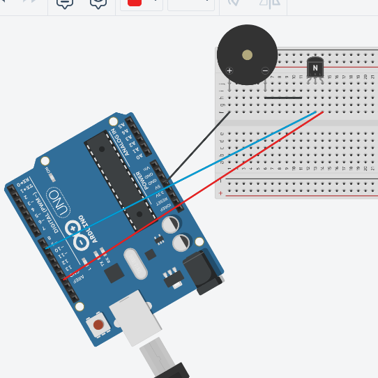

#Como funciona um transistor

um tranbsistor é feito de três terminais. A tensão aplicada para 2 terminais 
de um transistor define se no terceiro terminal passará corrente ou não

Uma forma muito útil de utilizar um transistor é utiliza-lo como chave de 
um sistema. 

#Transistor como Chave 

Podemos utilizar um transistor npn (como um BC337) para servir como chave 
para o sistema. O seu transistor pode estar naturalmente em curto ou estar 
com um circuito fechado.... Isso vai depender da aplicação que você precisa.
Nesse documento irei utilizar como exemplo um transistor de circuito aberto 
quando não passamos nenhuma corrente nele.

Para controlar o "liga e desliga" do transistor basta ligar a Base em uma 
tensão. Geralmente, a tensão da GPIO de microcontroladores são o suficiente 
para provocar o efeito liga e desliga que buscamos, mas isso pode não necessariamente
ser verdade, e, nesse caso, será necessário aumentar a tensão sobre a base para 
provocar algum efeito no seu transistor.

#Exemplo: Controle de um buzzer com a Odroid xu4

as portas GPIO da Odroid só conseguem mandar uma tensão de 1.8V. No entanto,
para  que um buzzer apite com intensidade adequada, é necessário mandar uma 
tensão 5V para o componente. 

Para resolver isso, vamos fazer um sistema de transitor que controla o tempo
que o buzzer ficará "ligado" com uma potência de 5V.

A ideia desse circuito é utilizar um transistor (BC337) para abrir e fechar o circuito
que liga ao Buzzer ao ground da placa.

Enquanto o circuito estiver aberto, não passará corrente pelo buzzer e ele não apitará.

Nessa imagem podemos ver o esquema de conexões que pode ser realizado para atingir
o resultado que queremos. Aqui utilizei um Arduíno apenas para a didática, mas podemos fazer
as mesma ligações na Odroid. 

Olhando o circuito da esquerda para a direita, o fio preto conecta o buzzer no 5V. depois conectamos 
o transistor em série com o terminal que seria o ground do buzzer, e conectamos no base (fio azul) uma das portas do arduíno que mandará um sinal 
para que o circuito seja fechado. Esse sinal é, basicamente, uma tensão aplicada pela placa Arduíno. O fio Vermelho
liga o ground do buzzer ao ground da placa. 

Mandando um sinal para a base do transistor, o sistema fecha e o buzzer apita. Quando retiramos esse sinal, o circuito abre 
e o buzzer para de apitar. 
