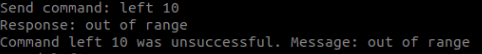

# Solucionando erros 
Essa página tem o intuito de mostrar as soluções encontradas para lidar com erros que ocorrem naturalmente com o uso do Tello com scripts em Python, ou fora do aplicativo.

## Auto-landing

Um dos problemas comuns que ocorriam era o Tello pousar inesperadamente, sem motivos aparentes. Isso pode acontecer por algumas razões:
- **Pouca bateria**: O Tello começa a piscar vermelho (como descrito na tabela do manual) e pousa. Vale a pena sempre mandar printar a bateria para monitorar isso.

 ```bash
  self.battery = self.tello.get_battery()
  print(self.battery) 
  ```
- **Muito tempo sem comandos**: Quando o drone não recebe um comando dentro de um determi-
nado período de tempo, ele pousa por motivos de segurança (por exem-
plo, quando seu programa caiu ou a conexão foi interrompida). Nesse
caso, o Tello pousa geralmente depois de 15 segundos sem receber co-
mandos, piscando vermelho tamb ́em (mas ”solid”). Cuidado, portanto,
se o seu c ́odigo tem time.sleep muito longo. Isso pode fazer o Tello pousar
ou perder conex ̃ao. A própria biblioteca DJITelloPy tem seus próprios
time.sleep embutidos, apesar de parecerem,  ás vezes, insuficientes mesmo.
A solução encontrada para isso foi mandar um sinal de "command" para
o drone a cada 10 segundos (em segmentos do código que dependem de
input no computador e, por isso podem demorar, ou em loops que de-
pendem da detecão da mão para mandar comandos). Isso parece que
resolveu o problema do Tello pousar automaticamente e não prejudica
a segurança, pois, se de fato perdermos a conexão com o Tello, ele irá
pousar automaticamente após 15 segundos. Veja abaixo a função:

```bash
def keep_tello_alive(self):
        #Manda sinal para o tello não pousar. Criamos uma função, pois chamaremos em outra classe
        if not SIMULATION:
            self.tello.send_control_command("command")
```
- **Falta de tempo de espera**: O contrário também pode acontecer. uando o Tello recebe comando sem ter terminado o  último,  ás vezes
pode dar erro e ele acabar pousando. Isso ocorre principalmente logo após *takeoff*. Mensagens de erro que ocorrem
quando falta delay são: **error Not joystick** ou **Exception: Command 'xxxx' was unsuccessful for 4 tries.**, por exemplo. Nessa situação, o Tello também pisca vermelho e pousa. Tente colocar algum *time.sleep* e veja se melhora. Ou, ainda, espere um pouco antes de rodar o programa logo após conectar com o Tello.
## Flip errors
Outro erro comum ao rodar script de python com o Tello é que ele não analisava o nível de bateria antes de mandar um comando de 'flip'. O problema é que abaixo de 50% de bateria, o drone não dá flips. Ao receber um comando de 'flip' sem ter bateria suficiente, o drone retorna **flip error** e isso pode causar erros maiores no código como **Exception: Command 'xxxx' was unsuccessful for 4 tries.** que pode levar ao pouso automático. Logo, foi incluído no código uma função que sempre verifica o nível de bateria e retorna se é possível dar 'flip' ou não (tudo armazenado na variável *self.tricks* do tipo *bool*):

```bash
 def get_tello_battery(self):
        if not SIMULATION:
            self.battery = self.tello.get_battery()
        else:
            self.battery = BATTERY

        if self.battery <= 50:
            self.tricks = False
        else:
            self.tricks = True
```
## Out of range
Além de erros de manobras com 'flip', cuidado ao mandar o Tello se movimentar para lugares impossíveis, por exemplo, ir para baixo 2 metros, sendo que ele está voando a um metro do chão. Ou ainda, mandar ele se movimentar em alguma direção abaixo de 20 cm (o mínimo é 20 cm). Quando mandamos algum desses comandos descritos, pode dar o seguinte erro:



Para evitar esse erro, verifique sempre se a movimentação é possível dentro das limitações do Tello. Por exemplo, em parte do código, verificamos se a altura a descer é possível dada a altura atual do drone:

 ```bash
  if getHeight - distance > minHeight:
                    print("Descendo", distance, "cm")
 ```

