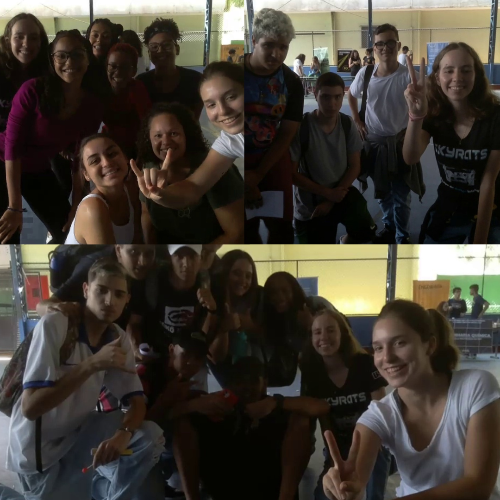

# Outras funcionalidades
## Tirando e salvando fotos
Em vários momentos do código, fazemos o Tello tirar fotos. Desde com os gestos "2"/paz e "rock" até no jogo das câmeras. Para fazer isso, há uma estrutura básica utilizando o OpenCV:
```bash
if not SIMULATION:
    self.image = self.tello.get_frame_read().frame  # Stores the current streamed frame

now = datetime.now()
day = date.today()

current_time = now.strftime("%H-%M-%S")
current_day = day.strftime("%b-%d-%Y")

if not os.path.isdir("fotos"):
    os.makedirs("fotos") # Cria pasta de fotos

save = f'fotos/{current_day}--{current_time}.jpg'
cv2.imwrite(save, self.image)
```
Veja algumas fotos tiradas utilizando gestos:


## Beepy
Beepy é uma biblioteca que foi utilizada para adicionar efeitos sonoros ao programa, tornando-o mais divertido. Isso pode ser feito pela seguinte linha, após importar `beepy`:
```bash
beepy.beep(5) # O número é escolhido para o som desejado
```
A seguir estão os mapeamentos para os números: 1 : 'coin', 2 : 'robot_error', 3 : 'error', 4 : 'ping', 5 : 'ready', 6 : 'success', 7 : 'wilhelm'.

## Janelas do OpenCV

Para criar janelas do OpenCV, a estrutura básica é:
```bash
cv2.imshow('MediaPipe Hands', self.image)
if cv2.waitKey(5) & 0xFF == ord('q'):
    self.control_loop = False
```
Nunca esqueça da condição do `waitKey`, pois sem ela, o código pode dar erro.

## Criando objetos (POO)

Como utilizamos diferentes classes no código (Drone, Interface e Tello, da biblioteca), precisamos criar objetos pertencentes a essas classes para poder rodar as funções:

```bash
# Na classe Drone:
self.tello = Tello() 
...
# Na classe Interface:
self.tello = Drone()

# Para rodar o código:
main = Interface()
main.interface_loop() # Função principal da interface
```
