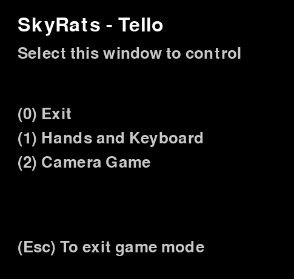

# Funções e variáveis
A seguinte página tem a intenção de descrever as funções principais do código de controle do Tello.
## Variáveis importantes
```bash
SIMULATION = False # False se estivermos rodando o script no Tello.
BATTERY = 65 # Valor usado para simulação
# ---------------------------- #

INTERFACE_FACTOR = 1    # Increase for better resolution monitor
HAND_SIZE = 1           # Decrease for smaller hands
```
## Classe Drone

### __init__()  
Tem a intenção de inicializar Mediapipe (mp) e variáveis. Além disso, chama a função startup que se conecta com o Tello, permitindo printar também seu estado (bateria, altitude, velocidade, etc). 
```bash
def __init__(self):

    self.tello_startup()
    # Inicializando Mediapipe
    self.mp_drawing = mp.solutions.drawing_utils
    self.mp_drawing_styles = mp.solutions.drawing_styles
    self.mp_hands = mp.solutions.hands

    self.state = self.tello.get_current_state()
    print(self.state)

    self.tricks = True # Assumindo que bateria está acima de 53%

    if self.tello.get_height() == 0: #Importante para caso rodemos o código com o Tello já decolado
      self.height = 0
      self.takeoff = False
    else:
      self.height = self.tello.get_height()
      self.takeoff = True

    # Inicializando variáveis
    self.prev_vector = [0, 0, 0, 0, 0]
    self.repeat = 0
    ...
    self.num_repeat = 30 # Mínimo para afirmar que foi feito um gesto 
```
### __tello_startup()__
Essa função tem o intuito de conectar o Tello, permitindo rodar o script. Para isso, primeiro, cria-se um objeto da classe Tello (biblioteca DJI). Depois, conectamos com o drone e iniciamos o stream da câmera.

```bash
# Inicialização do Tello
def tello_startup(self):
        # For Tello input:
    self.tello = Tello()  # Starts the tello object
    self.tello.connect()  # Connects to the drone
    self.tello.streamon()
```
### __get_tello_battery()__
Função que pega a bateria do Tello e atualiza a variável `self.tricks`. Essa variável é Falsa, caso a bateria esteja abaixo de 53% (margem de erro de 3%), previnindo que o Tello pouse automaticamente ao tentar dar flips (só funcionam acima de 50% de bateria). O intuito é chamar essa função constantemente para atualizar sempre se é possível ou não dar um flip.
```bash
# Atualizar valor da bateria
    def get_tello_battery(self):
        if not SIMULATION:
            self.battery = self.tello.get_battery()
        else:
            self.battery = BATTERY

        if self.battery <= 53:
            self.tricks = False
        else:
            self.tricks = True
```
### __tello_no()__
Função que faz o Tello rotacionar como se estivesse dizendo "Não". É chamada quando a bateria está abaixo de 53%, no caso, e ele recebeu o comando de dar flip.

```bash
# Negar truques por bateria insuficiente
    def tello_no(self):
        print(f"Bateria insuficiente! {self.battery}")
        if not SIMULATION:
            self.tello.rotate_clockwise(30)
            self.tello.rotate_counter_clockwise(60)
            self.tello.rotate_clockwise(30)
```
### __return_to_pos()__
Função que faz o Tello retornar para posição inicial (estimada) após dar um flip. O Tello pode ser instável ao fazer truques, principalmente se estiver em espaço aberto com vento. A intenção é fazer ele se mover para um sentido dependendo da orientação do flip dado. 
```bash
# Voltar para a posicao que estava antes do flip dependendo da orientação que é passada como parâmetro
    def return_to_pos(self, orientation):
            
        if orientation == 'back':
            print("moving foward...")
            if not SIMULATION:
                self.tello.move_forward(40)
        elif ...

```

### __keep_tello_alive()__
Função que manda um sinal para o Tello, evitando o pouso automático que ocorre se ele não recebe comandos em 15 segundos.
```bash
def keep_tello_alive(self):
        # Manda sinal para o tello não pousar. Criamos uma função, pois chamaremos em outra classe
        if not SIMULATION:
            self.tello.send_control_command("command")
```
### __hand_keyboard_control()__
Função que controla o Tello a partir de gestos e do teclado, simultaneamente. Na interface principal, isso é acessado apertando 1. 

#### _Ver o frame da câmera_
Para acessar cada frame do Tello:
```bash
self.image = self.tello.get_frame_read().frame  # Stores the current streamed frame
```
#### _Não deixar o Tello pousar_
Para não pousar o drone automaticamente, em loops, é interessante colocar para mandar um sinal a cada 10 segundos.
``` bash
if datetime.now() - self.start > timedelta(seconds=10):
                    self.keep_tello_alive()
                    self.start = datetime.now()
```
#### _Detectar mãos no Tello e a mais perto da câmera_

```bash
results = hands.process(self.image)
```
A próxima parte do código verifica se a mão identificada é A maior no frame. Fazemos isso calculando a área do triângulo formado entre os pontos 0, 5 e 17:


A tolerância do tamanho pode ser redefinida no início do código, nas variáveis importantes (`HAND_SIZE`). 
```bash
# área do triângulo central
# lm = landmark
    area = 1/2 * abs(lm0.x * (lm5.y - lm17.y) + lm5.x * (lm17.y - lm0.y) + lm17.x * (lm0.y - lm5.y)) / self.abs_area
        if area > larger:
            true_hand = potential_hand
            larger = area
```
Acima, vemos que se a área for grande o suficiente (maior que a maior mão anterior), a nova "mão verdadeira" é a atual e a tolerância foi redefinida para a área dessa mão nova.
#### _Verificar posição de cada dedo_
Em seguida, caso haja uma "mão verdadeira", ou seja, perto o suficiente, cria-se um vetor de dedos. Esse será modificado caso o dedo esteja levantado ("1") ou abaixado ("0").
```bash
# Inicializa vetor de dedos
finger_vector = [0, 0, 0, 0, 0]
```
A ideia para verificar se o dedo está abaixado ou não é traçar vetores entre os _landmarks_.
Veja o exemplo abaixo do polegar:
```bash
dist0 = ( (marks[5].x - marks[17].x)**2 + (marks[5].y - marks[17].y)**2 )**(1/2)  # Distância entre pontos 5 e 17

# Tolerância (Quanto menor, mais conservadora é a detecção)
TOL = 1.5 # Polegar

# Compara distâncias entre pontos para decidir quais dedos estão abertos ou fechados:

# polegar
finger_dist1 = ( (marks[4].x - marks[17].x)**2 + (marks[4].y - marks[17].y)**2 )**(1/2)
if finger_dist1 < TOL*dist0:
    finger_vector[0] = 0
else:
    finger_vector[0] = 1

```
Note que o que ele faz é basicamente verificar se o polegar está para fora da mão ou para dentro (fechado), dependendo dos _landmarks_ 4, 5 e 17. E a tolerância disso é um pouco maior (1.5).
Veja um teste no modo `SIMULATION`:


No momento em que mudamos para o polegar para fora, o código identifica como "flip right" (direita do drone).
Mas como ele percebe a orientação do polegar?
Como todo vetor tem direção e __sentido__, podemos também verificar se o polegar aponta para a direita ou para esquerda, vendo se o _landmark_ 4 está com abscissa maior ou menor que _landmark_ 17:
```bash
# Orientação do polegar no eixo X
if marks[4].x - marks[17].x < 0:
    self.orientation_x = 'right'
else:
    self.orientation_x = 'left'
```
A partir disso, é possível aplicar a mesma lógica para os outros dedos, utilizando _landmarks_ que façam sentido. Uma estratégia é sempre comparar a distância do _landmark_ 9 e 0 com a distância do ponto no extremo de cada dedo e do _landmark_ 0. Um exemplo com o indicador:


Veja que se a distância azul for maior que a vermelha, o indicador está levantado. Caso contrário, ele está abaixado. O primeiro vetor seria representado por `[1, 1, 1, 1, 1]` e o segundo vetor seria `[1, 0, 1, 1, 1]`.

_Confirmar gesto por contador de repetição_

Para ter certeza que a pessoa está fazendo um gesto, é verificado 30 vezes se é o mesmo gesto sendo identificado. Para seguir a mão, é verificado apenas 10 vezes para tornar mais rápida essa funcionalidade. Veja a estrutura base dessa lógica:
```bash
if self.repeat > self.num_repeat: # Se tiver detectado esse gesto várias vezes
    self.get_tello_battery() # Atualiza estado da bateria
    self.command = self.verify_commands(finger_vector) # Vai ver o que fazer com aquele gesto

    # Reiniciar variáveis
    self.prev_vector = [0, 0, 0, 0, 0]
    self.repeat = 0

# Se ainda não tiver o número mínimo de repetições para seguir a mão
else: 
# Mesmo vetor encontrado
    if finger_vector == self.prev_vector:
        self.repeat += 1
    # Se encontrar um vetor diferente
    else:
        self.repeat = 0
    # Vetor atual é o vetor anterior da pŕoxima iteração
    self.prev_vector = finger_vector

```
#### _Identificar comando vindo do teclado_
Nessa mesma função, também há uma parte do loop que sempre recebe comandos vindoo do teclado (caso alguma tecla seja apertada). A estrutura base disso é a seguinte:
```bash
for event in pg.event.get():

    self.get_tello_battery() #Atualiza estado de bateria

    if event.type == pg.KEYDOWN:

        if event.key == pg.K_w: #Exemplo com a tecla "w"

            print("Going foward...")

            if not SIMULATION:
                self.tello.move_forward(20) # Move o drone para frente

                 
```
Para colocar comandos em outras teclas é apenas repetir `if event.key == pg.K_x:` e adicionar uma ação dentro da condição (sendo `x` uma tecla qualquer).

###  __verify_commands()__
Função que vai verificar qual comando foi recebido a partir dos gestos com a mão identificada. Basicamente, comparamos o vetor recebido com o que queremos para mandar um comando para o Tello:

```bash
elif vector == [0, 1, 0, 0, 0]: #Vetor com indicador levantado apenas, "1"

            if self.tricks and self.orientation_y == 'back':

                print("Flip back!")

                if not SIMULATION:
                    self.tello.flip_back()
                
                self.return_to_pos(self.orientation_y) # Volta para posição inicial estimada
            else:
                self.tello_no() # Não possui bateria para fazer o flip
```
Os outros comandos seguem a mesma estrutura. O que muda é a ação desejada dentro da condição.
### __follow_hand()__
Essa função tenta seguir a mão identificada anteriormente. Ela é acessada no `verify_commands()` quando o vetor dos dedos é `[1, 1, 1, 1, 1]` (mão aberta). Ela recebe como parâmetros as coordenadas do _landmark_ 9 e as ordenadas dos extremos da mão (_landmark_ 12 e 0). Assim, é possível tentar centralizar no frame da câmera o _landmark_ 9, com uma tolerância previamente definida na função. Importante ressaltar que o ponto (0,0) é no canto superior esquerdo e o ponto (1,1) é no canto inferior direito. Veja a estrutura base dessa lógica para uma centralização da mão no eixo X:
```bash
P_tol = 0.075 # Quanto maior -> menos responsivo

x_error = (pixel[0] - 0.5) # pixel[0] é a abscissa do landmark 9

if abs(x_error) < P_tol:

    x_error = 0 # Ignora, se estiver dentro da tolerância -> importante para não floodar comando para o drone

x_vel = -int(100*x_error) 

 if not SIMULATION:
    mod_x = abs(x_vel) # Arredonda velocidade

    if mod_x > 40:
        mod_x = 40

    if mod_x >= 20:
        if x_vel < 0:
            self.tello.move_left(mod_x) # Manda o Tello para a esquerda (velocidade negativa)
        else:
            self.tello.move_right(mod_x)
            # Manda o Tello para a direita (velocidade positiva)
```
A ideia inicial era mandar um comando de `self.tello.send_rc_control`, definindo uma velocidade para o eixo x, y e z. Entretanto, isso acabava por floodar o Tello de mensagens, inclusive com as três velocidades setadas para 0. Foi decidido então mover o Tello com o comando `self.tello.move_left` (ou right), dependendo de quão descentralizado estiver o _landmark_ 9. Além disso, o Tello não se move mais para cima ou para baixo. ELe segue a mão apenas no eixo X, por razões de segurança e porque deixa o movimento mais fluido. Entretanto, deixamos uma estrutura no código, caso alguém queira setar alguma velocidade para o Tello no eixo Y. 
De qualquer forma, ainda adicionamos um limite de altura, para que ele não suba muito, se fóssemos alterar sua posição no eixo Y ao seguir a mão:
```bash
if not SIMULATION:
    self.height = self.tello.get_height()
    if self.height > 200: # Se estiver acima de 2 metros, deve descer
        print("Too high, mooving down...")
        self.tello.move_down(40)
```
Para finalizar, colocamos também uma medida de segurança para o Tello se afastar da mão, caso ela esteja muito perto. Isso é feito medindo a distância entre os extremos da mão:
```bash
z_error = abs(ext_up - ext_down) # Distância entre extremos da mão

if not SIMULATION:
    if z_error > 0.8: 
        print("Too close! Moving backwards...")
        self.tello.move.back(30) #Move o Tello para trás
    else:
        z_error = 0
```
Como a medida do topo até a base do frame é 1, se a distância entre os _landmarks_ 12 e 0 for maior que 0.8, o drone se afasta 30 cm da mão.

### __follow_camera_game()__

Função do jogo de câmeras, em que a pessoa deve tentar aparecer no frame do Tello enquanto o drone realiza movimentos de rotação e descida/subida.

O jogo se inicia com o usuário escolhendo um nível de dificuldade, que vai de 1 a 3, assim como o número de fotos que deseja tirar. Tudo isso é obtido pelo `input`. Basicamente, quanto mais difícil, menor é o intervalo entre as fotos e a pessoa deve se movimentar mais rápido:
```bash
time.sleep(5-int(difficulty))
```
Se o Tello rotaciona, desce ou sobe é aleatório, assim como o quanto que ele se move ou gira:
```bash
choices = ["left", "right", "up", "down"]
deg_choices = [30, 40, 50, 60]
dist_choices = [20, 30, 40]
...
choice = random.choice(choices)
...
if choice == "left":
    degrees = deg_choices[random.randint(0, 3)]
    print("Girando", degrees, "° para a esquerda")
    if not SIMULATION:
        self.tello.rotate_counter_clockwise(degrees)

```
A mesma estrutura se aplica às outras opções. Um problema, entretanto, é não mandar o Tello para alturas muito grandes ou muito baixas. Por isso, colocamos um limite `minHeight` e `maxHeight` de 170 cm e 20 cm, respectivamente. Assim, se a distância aleatória para subir ou descer distoar desse parâmetros, é mandado o Tello se movimentar no sentido contrário. Veja um exemplo:

```bash
if not SIMULATION:
    getHeight = self.tello.get_height()
...

elif choice == "down": 
    distance = dist_choices[random.randint(0, 2)]
    if getHeight - distance > minHeight:
        print("Descendo", distance, "cm")
        if not SIMULATION:
            self.tello.move_down(distance)
            getHeight -= distance
                    
        else: #if it is lower than the min height, move up instead
            print("Subindo", distance, "cm")
            if not SIMULATION:
                self.tello.move_up(distance)
                getHeight += distance

```
Essa escolha aleatória de movimentação acontece dentro de um loop que é repetido para o número de fotos a serem tiradas (que foi escolhido pelo usuário).
```bash
 for i in range(num_pictures):
```
Veja alguns dos resultados :)


## Classe Interface

### __init()__
Essa função chama outras funções e cria um objeto do tipo `Drone`:
```bash
def __init__(self):
    print("\nBem vindo!")
    self.tello = Drone()

    self.print_commands()
    self.create_window()

```
### __create_window()__
Função que cria janela da interface com o uso da biblioteca `Pygame`.
Para criar uma janela:
```bash
self.f = INTERFACE_FACTOR # AJustando tamanho da janela
self.dim = (500*self.f, 480*self.f)
pg.init()
self.win = pg.display.set_mode((self.dim[0], self.dim[1]))
pg.display.set_caption("Pygame")
```
Para criar um tipo de texto que posteriormente (em outra função, em loop) será adicionado na janela:

```bash
font = pg.font.Font('freesansbold.ttf', int(16+self.f*16))

white = (255, 255, 255)
black = (0, 0, 0)

self.text = font.render('SkyRats - Tello', True, white, black)
```
A mesma estrutura pode ser repetida para criar outros textos.

### __print_commands()__
Apenas printa os comandos da interface no terminal:


### __interface_loop()__
Loop da interface. Nela é criada a janela e também são recebidos os comandos do teclado para acessar outras funcionalidades do programa, utilizando a mesma estrutura já vista antes na função do `hand_keyboard_control()`. Aqui também é utilizada a função `self.keep_tello_alive()` para evitar que o drone pouse automaticamente.
Para adicionar textos na janela do Pygame: 
```bash
d0 = 30*self.f
...
self.win.blit(self.text, (d0, d0))
```
Após configurar como desejado a janela, você deve chamar `pg.display.update()` para fazer com que a janela realmente apareça no monitor do usuário:


