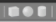

# Gazebo/Simulation Guide

# Gazebo

É um simulador que usamos aqui na Skyrats para simular as missões que vamos realizar com o drone na vida real.

## Básicos

Para instalar ele, as instruções no seguinte guia já fazem isso: [https://github.com/SkyRats/knowledge_base/blob/main/guias/Instalacao.md](https://github.com/SkyRats/knowledge_base/blob/main/guias/Instalacao.md); se precisar de mais informações sobre sua instalação: [http://gazebosim.org/tutorials?tut=install_ubuntu](http://gazebosim.org/tutorials?tut=install_ubuntu).

O comando abaixo abre o gazebo

`gazebo <opções de inicialização>`

Mas também da para abrí-lo com mais condições. Pode abrir diretamente um mundo usando o mesmo comando colocando o caminho para o `.world`, ou colocando o nome do arquivo estando na pasta world. Por exemplo: `gazebo exemplo.world` Mais uma explicação ou informaçes de uso sobre o comando ou codigo

Também pode iniciar o gazebo fazendo a simulação da PX4. Estando na raiz do Firmware dê o comando:

`make px4_sitl gazebo`

E também pode inciar o Gazebo junto com o ROS usando o roslaunch, e é bom por que da para abrir rosnodes, packages e outras funções do ros junto.

`roslaunch gazebo_ros <exemplo.launch>`

No roslaunch pode colocar vários argumentos de incialização, [clique aqui para ver](http://gazebosim.org/tutorials/?tut=ros_roslaunch)

[Tutorial de inicialização do gazeb](http://gazebosim.org/tutorials?tut=quick_start)o

## Os arquivos

### Models

São os modelos que aparecem no mundo, por exemplo: caixas, paredes, cenários, dummies e até o próprio drone.

Dentro do gazebo, nós temos dois jeitos para criar models e um para edição, sendo eles:

Na barra cima do painel de simulação:



Esses 3 botões podem criar um cubo, uma bola e um cilindro, todos com propriedades de inércia e colisão.

Indo em Edit→Building Editor


Nessa parte você criar casas e outras construções urbanas ou relacionadas, pois facilita bastante.

Para usar:

Para fazer as paredes, janelas, portas e escadas, você primeiramente seleciona o tipo, cor e textura no painel da esquerda, e "desenha" em vista superior na malha branca superior a construção a ser feita. Pode também ver que tudo é dividido em "levels", esses são os andares das construções.

Model Editor:

Tem dois caminhos, o primeiro, a partir de nenhum objeto é: Edit→Model editor, o outro você pode modificar um model existente, selecione ele, no display de simulação ou no painel esquerdo, depois clique com botão direito → Edit Model.

Ambos vão abrir o painel do model editor.

Nesse painel, seu objeto selecionado a ser editado fica em laranja, o resto branco(ambos transparentes).

No painel a esquerda, na aba insert, você pode fazer algumas coisas, como colocar mais objetos, sendo as "simple shapes", ou "custom shapes"(para outros models feitos fora do gazebo, vou explicar depois), na aba model, você pode deixar o objeto static, que deixa ele fixado no mundo(isso não afeta a caixa de colisão, ele apenas não consegue se mover), pode adicionar plugins, e visualizar links e joints, e dar auto-disable.

### Joints:


No model editor, na barra superior, assim como na imagem acima, você pode criar "joints", elas são ligações entre models, ou entre links de algum model, (links são "models de models", ou melhor, partes de um model que teem representação própria, no drone por exemplo, tem o link do frame, dos rotores e pás, do LiDar, etc..). Essas ligações podem ser de vários tipos, cada um com sua característica, por exemplo, a joint ball é uma ligação com rotação livre em 6 eixos (x, y, z, roll, pitch, yaw), tem a revolute joint, que permite rotação em um eixo, o qual você seleciona o eixo no qual vai ser o livre, entre outros...

### Corda no Gazebo

### Funcionamento

O pacote criado pela Skyrats possui um script capaz de criar um model que simula uma corda no Gazebo. A ideia principal é utiliza-la para missões que envolvam o carregamento de objetos, como a Outdoor e Swarm.

Como o Gazebo só é capaz de simular corpos rígidos, que não é o caso de uma corda, algumas adaptações precisaram ser feitas. A corda foi criada por meio da união de vários links, no formato de cilindro, empilhados um acima do outro. Para uni-los, foi utilizado um joint do tipo ball, que permite rotação em todos os eixos. Assim, a corda é formada por um conjunto de corpos rígidos unidos para dar a impressão de que atuam como uma corda.

Portanto, o realismo da simulação é diretamente proporcional a quantidade de links. Quanto mais links o modelo tiver para um mesmo tamanho, maior será a semelhança com uma corda real. Entretanto, um número muito alto de links pode afetar o FPS e o real time factor, deixando a simulação lenta, o que, em alguns casos, chega a ser inutilizável. Baseado em testes empíricos, 10 a 20 links para uma corda de um metro costuma ser o ideal para conciliar a performance e o desempenho.

### Como utilizar

Para utilizar o script, basta entrar no diretório scripts do pacote de simulação e executar Corda.py. O programa irá pedir que você insira a quantidade de links desejados e o tamanho de cada link. Dessa forma, é possível controlar o tamanho final da corda realizando uma conta simples: número de links vezes tamanho do link. Após digitar essas entradas, o model da corda estará na pasta models do pacote de simulação, onde é possível utilizar diretamente no Gazebo utilizando a aba insert caso você tenha feito setup.bash.

### Explicacao do Script
(...)

### Como funciona o arquivo model?

Ele, basicamente precisa de dois arquivos, um sendo `.config`, e outro `.sdf`ou `.urdf`. Todos funcionando na linguagem XML.

O .config tem esse estilo:

[https://github.com/SkyRats/simulation/blob/master/models/drone_indoor/model.config](https://github.com/SkyRats/simulation/blob/master/models/drone_indoor/model.config)

Onde é declarado o nome do model, versão do model, a versão do sdf(1.6), configurações do autor e descrições do objeto.

O .sdf tem esse estilo:

[https://github.com/SkyRats/simulation/blob/master/models/drone_indoor/model.sdf](https://github.com/SkyRats/simulation/blob/master/models/drone_indoor/model.sdf)

Todas as coisas do objeto estão nesse arquivo, por exemplo, a mesh, plugins, orientações, add de links, add de outros models, joints, materials, e todo o resto possível.

Como é muito grande as coisas, temos muitos exemplos no nosso repositório simulation e outras infos sobre o .sdf e seus atributos aqui: [http://sdformat.org/spec?ver=1.7&elem=model](http://sdformat.org/spec?ver=1.7&elem=model)

### Worlds

Eles são os mundos no gazebo, ou seja, são meio que uma junção de models com suas posições e configurações.

Eles podem ser configurados direto no gazebo, adicionando coisas no painel de simulação, sendo pelo painel esquerdo, adicionando modelos na parte "insert", e na aba world visualizar as configurações existentes do mundo, nas aba de cima, pode mudar a configuração de posição, rotação e escala manualmente dos models, adicionar fontes de luz e mexer a camera.

Pelo arquivo .world, da para fazer e adicionar todas as configurações do mundo, adicionando models, mudar posição, rotação, escala dos mesmos, adicionar plugins de mundo e configurar a GUI, sendo essa infinitamente customizável ( Vou explicar mais para frente ), como por exemplo, adicionar interfaces com botões, labels, etc, 100% customizáveis, que podem fazer qualquer coisa dentro do gazebo, customizar configurações de iluminação, câmera e céu, entre outros.

Temos vários exemplos de .worlds no nosso repositório simulation, além disso, todas as configurações para o .world tem aqui: [http://sdformat.org/spec?ver=1.7&elem=world](http://sdformat.org/spec?ver=1.7&elem=world)

## Adicionar Meshs de Outros Programas

### Quais os arquivos?

No gazebo, p/ usar meshs externas, os principais tipos de arquivos suportados pelo sdf arquivos .dae, .obj, .stl. Com observação de que o .obj e o .stl não suporta materiais/texturas, o .dae é melhor não ser usado para transportar texturas pois ele dá problemas com sombras fixas nesse transporte de arquivos; em relação a desempenho/qualidade, o .dae é o mais "leve", enquanto o .stl é mais "pesado", porém ambos são bem otimizados; como comparação o .stl é superior na maioria dos casos.

Em relação as texturas, os tipos de arquivos citado acima não suportam/não suportam bem. O recomendado é usar scripts de materiais. O seguinte link explica muito bem como fazer: [http://gazebosim.org/tutorials?tut=color_model](http://gazebosim.org/tutorials?tut=color_model)

### Como adicionar a mesh?

Primeiro cria uma pasta para o model, exemplo: `mkdir model; cd model` , depois crie os arquivos de config, sdf, e outra pasta para guardar a mesh: `mkdir meshes; touch model.config model.sdf` 

Nisso, você coloca a mesh dentro da pasta, configura seus arquivos .sdf e .config. P/ adicionar a mesh no .sdf, só usar um "include" dentro da parte da configuração do link, como exemplo:

```xml
<geometry>
       <mesh>
            <uri>model://model/meshes/mesh.stl</uri>
      </mesh>
</geometry>
```

Lembre-se que deve-se colocar o link para a mesh na colision box e no visual.

# Programação no Gazebo e Plugins

Tudo que vimos até agora é uma pequena parte do que da para fazer com o gazebo, com plugins, ele fica 100% configurável e ajustável p/ qualquer simulação.

Por ser infinitamente longo, vou ensinar o jeito de como buscar e começar a fazer alguma programação/plugin em cima do gazebo e explicar alguns códigos.

### Como funciona?

Os plugins do gazebo são em C++ OO e se dividem em 3 tipos principais, os de model, de world ou de GUI.

Os de model são, como o nome já diz, inicializados em models, por exemplo, dentro do .sdf:

```xml
				<include>
            <plugin name = 'wind_gazebo' filename = 'libgazebo_wind_plugin.so'>
                <robotNamespace/>
                <linkName>base_link</linkName>
                <xyzOffset>0 0 0</xyzOffset>
                <windForceMean>10</windForceMean>
                <windForceMax>50</windForceMax>
                <windForceVariance>0</windForceVariance>
                <windDirectionMean>0 1 0</windDirectionMean>
                <windDirectionVariance>0</windDirectionVariance>
            </plugin>
            <uri>model://model</uri>
        </include>
```

Esse é um exemplo de como adicionar um plugin com parâmetros dentro do sdf, no caso o plugin do vento.

### Como declarar os tipos?

Para indicar qual o tipo de plugin, coloque no código o seguinte comando, sendo para modelo, gui ou world. Coloque ele depois de tudo ou antes de tudo,(em cima ou embaixo dos métodos, nunca dentro de nenhum).

```cpp
GZ_REGISTER_GUI_PLUGIN(NomeDaClasse)
GZ_REGISTER_MODEL_PLUGIN(NomeDaClasse)
GZ_REGISTER_WORLD_PLUGIN(NomeDaClasse)
```


Além disso, os plugins de model possuem duas formas de rodar, uma única no Load do model, e outra no OnUpdate(Como se fosse um while(1)... obs: não façam while(1) pfv).

Como exemplo temos o método load do plugin "GetDropZonePositions"

```cpp
public: void Load(physics::ModelPtr _parent, sdf::ElementPtr _sdf)
        {
            ignition::math::Pose3d dz_clean_pose = _parent->WorldPose();
            ignition::math::Vector3<double> dzc_p = dz_clean_pose.Pos();
            double CP_V[3] = {dzc_p.X(), dzc_p.Y(), dzc_p.Z() };
            gzmsg << "Dropzone pose:"<< "\n\tX = " << CP_V[0] << "\n\tY = " << CP_V[1] << "\n\tZ = " << CP_V[2] << std::endl;
        }
```

essa função load recebe dois atributos, no caso, o _parent que é o próprio model dentro do mundo, e o _sdf que é o sdf do model que foi inserido no mundo. No caso, a função dessa função .-. é de dar no início do model a posição dele no mapa, pois ele foi inserido de forma aleatória usando o modo population do .world.

Primeiro, ele cria um objeto de Pose3d, que representa a posição do objeto no mundo, e atribui a ele a posição do mundo usando o método WorldPose() do model _parent, depois disso, ele cria um vector3, que é um objeto com informações sobre posição em x,y,z e nele atribui o vector3d de dentro do pose 3d usando o método Pos(), e nisso ele coloca um vetor de 3 posições cada uma das posições e depois printa elas com gzmsg, p aparecer destacado no terminal como mensagem do gazebo.

E como exemplo do método OnUpdate temos o do plugin dos Dynamic Obstacles:

```cpp
public: void OnUpdate()
        {
						//1
            if (!this->toggle_status)
            {
                this->model->SetLinearVel(ignition::math::Vector3d(0, 0, 0));
                this->model->SetAngularVel(ignition::math::Vector3d(0, 0, 0));
                return;
            }
						//2
            double v;
            ignition::math::Vector3<double> curr_pos = this->link->WorldCoGPose().Pos();         
            double x_direction = (curr_pos - this->point_0).Dot(this->direction);
            //3
            if (this->goal_point == 1)
            {
                if (x_direction <= this->distance)
                {
                    v = this->vel;
                }
                else
                {
                    v = -this->vel;
                    this->goal_point = 0;
                }
            }
						//4
            else
            {
                if (x_direction >= 0) {
                    v = -this->vel;
                }
                else
                {
                    v = this->vel;
                    this->goal_point = 1;
                }
            }
						//5
            this->model->SetLinearVel(v*this->direction);
            this->model->SetAngularVel(ignition::math::Vector3d(0, 0, 0));
        }
```

A função está dividida em 5 partes, com os respectivos comentários. Como explicado anteriormente, a função OnUpdate roda a cada atualização do mundo(alguns milissegundos, tudo depende do Real Time Factor), parecido com a ideia do "void loop()" do arduino; começando pela parte  da função  `//1`; com o toggle_status, ele verifica se a movimentação dos obstáculos foi ativada pelo  usuário(veremos isso mais p frente em plugins de interface); se ela estiver desativada ele desliga a velocidade dos objetos, linear e angular, e retorna a função. No `//2` , ele declara uma variável double v, que mais para a frente vai receber valores de velocidade, depois ele cria uma variável do tipo Vector3 em double, que é como se fosse um vetor cartesiano, com 3 dimensões, porém em formato de objeto ao invés de variável, e esse Vector3, com nome curr_pos, recebe a posição do objeto naquele instante, usando o método do método do link "WorldCoGPose().Pos()" para retornar a posição cartesiana do mesmo em Vector3, e em outra variável double, a x_direction, recebe o produto escalar(.Dot()) entre a direção entre o ponto inicial e final do ciclo(aparece em outras partes do código) e a posição atual dele, para assim saber o sentido que ele está percorrendo na trajetória. Em `//3` , entra no loop assumido que o objeto está se movendo em direção ao ponto 1 da trajetória, e nisso ele verifica se o x_direction, que é o produto escalar entre o vetor posição do objeto e da direção, sendo ele maior que a distância se o x_direction coincidir com a sua chegada no ponto 1, se for verdadeiro, ele assume a velocidade positiva ao V, caso contrário, ele assume velocidade negativa e coloca como ponto de destino o ponto 0, assim, no `//4` , estando em direção do ponto 0(ponto de início), ele verifica se o x_direction é maior/igual a zero, se for, ele ainda está em direção ao ponto 0, assumindo velocidade negativa, caso contrário ele assume velocidade positiva e toma como direção o ponto 1. E no `//5` , ele coloca no objeto as velocidades, no caso sendo a angular como 0 fixa, para ele não ter movimentação angular.

Os plugins de mundo, tem como maior finalidade modificar o mundo em um instante inicial, pois ele só tem a condição de ser realizado com o método "Load", tem como o exemplo o método do "Attach Rope" ([https://github.com/SkyRats/simulation/blob/master/plugins/attach_rope.cc](https://github.com/SkyRats/simulation/blob/master/plugins/attach_rope.cc))

### OBS::

Por mais que os plugins tem os métodos Load ou OnUpdate, que permitem que ele rode uma ou mais vezes, ou em Loop, temos o sistema de msgs, que abre mais infinitas opções... falarei mais para a frente

### Plugins de GUI

Esses plugins permitem que nós possamos criar uma nova interface para o gazebo, não só com botões, mas com displays, barras de inserções, e infinitas possiblidades.


Como exemplo nós temos do plugin feito em 2020 para facilitar e controlar as simulações, vou explicar resumidamente o código:

(Obs: vou mostrar o .cpp, mas vale muito a pena ir olhando o .h do código, vai ajudar muito no entendimento)

```cpp
#include <sstream>
#include <gazebo/msgs/msgs.hh>
#include "simulation/skyrats_interface.hh"
#include <ignition/msgs.hh>
#include "simulation/common.h"
#include <fstream>
#include <math.h>

using namespace gazebo;

//1
GZ_REGISTER_GUI_PLUGIN(GUIExampleSpawnWidget)

GUIExampleSpawnWidget::GUIExampleSpawnWidget()
  : GUIPlugin()
{
  gzmsg << "Hello world" << std::endl;
  this->counter = 0;
  this->wind_status = false;
  this->smoke_status = false;

  //2
  this->setStyleSheet(
      "QFrame { background-color : rgba(95, 139, 250, 255); color : blue; }");

  //3
  QHBoxLayout *mainLayout = new QHBoxLayout;

  //4
  QFrame *mainFrame = new QFrame();

  //5
  QVBoxLayout *frameLayout = new QVBoxLayout();

  //6
  QPushButton *WindButton = new QPushButton(tr("ON/OFF WIND"));
  connect(WindButton, SIGNAL(clicked()), this, SLOT(WindButton()));

  QPushButton *SmokeButton = new QPushButton(tr("ON/OFF SMOKE"));
  connect(SmokeButton, SIGNAL(clicked()), this, SLOT(SmokeButton()));

  QPushButton *ObstacleButton = new QPushButton(tr("ON/OFF OBSTACLE"));
  connect(ObstacleButton, SIGNAL(clicked()), this, SLOT(ObstacleButton()));

  QPushButton *AttachButton = new QPushButton(tr("Rope Attach"));
  connect(AttachButton, SIGNAL(clicked()), this, SLOT(AttachButton()));

	//7
  QLabel *Skyrats_txt = new QLabel(("Skyrats Simulator v1.0"));

  //8
  frameLayout->addWidget(Skyrats_txt);

  frameLayout->addWidget(WindButton);

  frameLayout->addWidget(SmokeButton);

  frameLayout->addWidget(ObstacleButton);

  QLabel *indoor_txt = new QLabel(("Indoor Simulation"));
  
  frameLayout->addWidget(indoor_txt);

  frameLayout->addWidget(AttachButton);

  QLabel *outdoor_txt = new QLabel(("Outdoor Simulation"));
  
  frameLayout->addWidget(outdoor_txt);

  //9
  mainFrame->setLayout(frameLayout);

  //10
  mainLayout->addWidget(mainFrame);

  //11
  frameLayout->setContentsMargins(0, 0, 0, 0);
  mainLayout->setContentsMargins(0, 0, 0, 0);

  this->setLayout(mainLayout);

 
  this->move(10, 10);
  this->resize(160, 235);

  //12
  this->node = transport::NodePtr(new transport::Node());
  this->node->Init();
  this->factoryPub = this->node->Advertise<msgs::Factory>("~/factory");  

  this->wind_toggle_pub = this->node->Advertise<msgs::Int>("~/wind_toggle");

  this->smoke_pub = this->node->Advertise<msgs::Scene>("~/scene");

  this->obstacle_toggle_pub = this->node->Advertise<msgs::Int>("~/obstacle_toggle");

  this->attach_pub = this->node->Advertise<msgs::Int>("~/rope_attach");
}

/////////////////////////////////////////////////
GUIExampleSpawnWidget::~GUIExampleSpawnWidget(){
}
//13
void GUIExampleSpawnWidget::WindButton()
{
  msgs::Int msg;
  this->wind_status = !this->wind_status;
  msg.set_data(this->wind_status);
  this->wind_toggle_pub->Publish(msg);
  gzmsg << "Wind status: " << wind_status << std::endl;
}

void GUIExampleSpawnWidget::SmokeButton()
{
  msgs::Scene smk_msg;
  msgs::Fog* fog = new msgs::Fog;
  this->smoke_status =! smoke_status;
  smk_msg.set_name("smoke_toggle");
  if (smoke_status == 0){
    smk_msg.clear_fog();

    fog->set_start(10000.0);
    fog->set_density(0.0);
    fog->set_end(30000.0);

    smk_msg.set_allocated_fog(fog);
  }
  if (smoke_status == 1){
    fog->set_start(0.1);
    fog->set_density(300.0);
    fog->set_end(10.0);

    smk_msg.set_allocated_fog(fog);
  }
  
  this->smoke_pub->Publish(smk_msg);
  gzmsg << "Smoke status: " << smoke_status << std::endl;
  gzmsg << "A_Fog status: " << smk_msg.has_fog() << std::endl;
}

void GUIExampleSpawnWidget::ObstacleButton()
{
  msgs::Int obstacle_msg;
  this->obstacle_status = !this->obstacle_status;
  obstacle_msg.set_data(this->obstacle_status);
  this->obstacle_toggle_pub->Publish(obstacle_msg);
  gzmsg << "Obstacle status: " << obstacle_status << std::endl;
}

void GUIExampleSpawnWidget::AttachButton()
{
  gzmsg << "Rope attached message sent..." << std::endl;
  msgs::Int attach_msg;
  attach_msg.set_data(1);
  this->attach_pub->Publish(attach_msg);
}
```

O código ta dividido em 13 partes para facilitar a explicação:

`//1` → É registrado o plugin como plugin de interface(obs: isso pode ser declarado no começo ou no final, embora na maioria dos plugins seja no final)

`//2` → Define o estilo do "fundo" da interface adicionada ao gazebo, no caso foi utilizado o padrão RGB, mas existem outros, tudo isso pode ser visto na documentação do QWidgets.

`//3` → Cria um layout do QWidget em formato de caixa para guardar a interface

`//4` → Cria o frame principal(Obs: o frame é a área toda ocupada pela interface, e o layout é onde ficarão os itens da interface).

`//5` → Cria uma layout para o frame.

`//6` → Aqui ele cria os botões da interface, criando um ponteiro para eles e chamando um construtor, enviando uma string, sendo essa string a que aparecerá em cima do botão em sua implementação, aleḿ disso na próxima linha ele liga o botão ao seu método, declarando seu tipo de funcionamento, como no exemplo, o cliked(), que funciona como um botão de pressão, que ele realiza uma única vez o código ao ser precionado, necessitando ser pressionado denovo para uma nova execução do código.

`//7` → Cria uma Label com uma string, sendo a Label alguma string/texto colocada no layout da interface.

`//8` → Ele adiciona todos os objetos criados no layout do frame, usando o método addWidget(). Obs: Os objetos são colocados na ordem que são escritos no código, sendo de cima para baixo, como se fosse uma fila.

`//9` → Aqui ele coloca o layout principal do frame como sendo o layout criado anteriormente em que foi adicionado todos os widgets.

`//10` → Adiciona o outro layout criado como um widget do frame.

`//11` → Configura a margem dos dois layouts criados e adicionados, no caso setando as duas como 0 em todas as dimensões.

`//12` → Aqui ele cria os nodes e publishers que serão usados nos códigos dos métodos de cada botão, essa parte vou explicar com bastante detalhes mais para a frente.

`//13` → Aqui, por final ele cria os métodos de cada botão adicionado. Em cada método, que foi declarado no .h e associado a cada botão no passo 6 é descrito o código que rodará de acordo com o esquema de pressão do botão, no caso dos "clicked()", cada código desse rodará uma vez a cada vez que o botão for pressionado.
